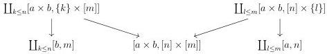

4.2. BASIC CONSTRUCTIONS

Proposition 4.2.1.45. The adjunction (4.2.1.44) is an adjoint equivalence. As a consequence, we have an equivalence

\[
(\infty , \omega) \text {-cat} \sim \lim _ {n: \mathbb {N}} (\infty , n) \text {-cat}.
\]

Proof. According to proposition 4.2.1.27, any sequence \((C_n)_{n:\mathbb{N}}:\lim_{n:\mathbb{N}}(\infty ,n)\)-cat has a special colimit. Let \(k\) be an integer. According to proposition 4.2.1.41, this implies the equivalence

\[
\tau_ {k} (\underset {n: \mathbb {N}} {\operatorname{colim}} C _ {n}) \sim \underset {n: \mathbb {N}} {\operatorname{colim}} (\tau_ {k} C _ {n}).
\]

Furthermore, the sequence  \( (\tau_{k}C_{n})_{n:\mathbb{N}} \)  is constant after the rank k. We then have

\[
\tau_ {k} \underset {n: \mathbb {N}} {\operatorname{colim}} C _ {n} \sim \tau_ {k} C _ {n}.
\]

This directly implies that the unit of the adjunction (4.2.1.44) is an equivalence.

To conclude, one has to show that the right adjoint is conservative, i.e that a morphism \( f \) is an equivalence if and only if for any \( n \), \( \tau_{n}f \) is an equivalence. This last statement is a direct consequence of proposition 4.2.1.9.

4.2.1.46. The following proposition states that the cartesian product preserves colimits in both variables. There exists then an internal hom functor that we denote by \(\underline{\mathrm{Hom}}(-, -)\).

Proposition 4.2.1.47. The cartesian product in  \( (\infty,\omega) \) -cat preserves colimits in both variables.

We first need several lemmas:

Lemma 4.2.1.48. Let \(a, b\) be two globular sums, and \(n, m\) two integer. The colimit in \(\mathrm{Psh}^{\infty}(\Delta[\Theta])\) of the diagram

is \([a,n]\times [b,m]\)

Proof. The lemma 4.1.1.6 implies that the object

\[
K := \coprod_ {k \leq n} [ b, m ] \coprod_ {\coprod_ {k \leq n} [ a \times b, \{k \} \times [ m ] ]} [ a \times b, [ n ] \times [ m ] ]
\]

is strict. As the induced morphism  \( \coprod_{l\leq m}[a\times b,[n]\times\{l\}]\to K \) , is a monomorphism, the lemma op cit implies that the colimit of the diagram given in the statement is strict. We can then show the result in the category of set valued presheaves on  \( \Delta[\Theta] \)  and we leave this combinatorial exercise to the reader.

195