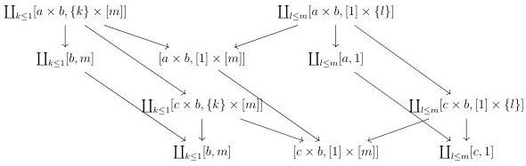

CHAPTER 4. THE $(\infty, 1)$-CATEGORY OF $(\infty, \omega)$-CATEGORIES

**Lemma 4.2.1.49.** *Let $f$ be a morphism of $\mathrm{W}_1$ and $n$ an integer. The morphism $f \times [n]$ is in $\widehat{\mathrm{W}}_1$.*

*Proof.* Suppose first that $f$ is of shape $\mathrm{Sp}_m \to [m]$. Remark first that for any $k$, $[k] \times [m]$ is $\mathrm{W}_1$-local as both $[k]$ and $[m]$ are. We then have $\mathbf{F}_{\mathrm{W}_1}([k] \times [m]) \sim [k] \times [m]$. As the fibrant replacement preserves colimits and as the cartesian product in $(\infty, 1)$-categories preserves colimits, we have a sequence of equivalences in $(\infty, 1)$-cat:

$$\begin{array}{rcl} \mathbf{F}_{\mathrm{W}_1}(\mathrm{Sp}_m \times [n]) & \sim & \mathbf{F}_{\mathrm{W}_1}([1] \times [n]) \coprod_{\mathbf{F}_{\mathrm{W}_1}([0] \times [n])} \cdots \coprod_{\mathbf{F}_{\mathrm{W}_1}([0] \times [n])} \mathbf{F}_{\mathrm{W}_1}([1] \times [n]) \\ & \sim & [1] \times [n] \coprod_{[0] \times [n]} \cdots \coprod_{[0] \times [n]} [1] \times [n] \\ & \sim & [m] \times [n] \end{array}$$

By construction, the morphism $\mathrm{Sp}_m \times [n] \to \mathbf{F}_{\mathrm{W}_1}(\mathrm{Sp}_m \times [n])$ is in $\widehat{\mathrm{W}}_1$. We proceed similarly for the case $f := E^{eq} \to [0]$.

*Proof of proposition 4.2.1.47.* As the cartesian product on $\mathrm{Psh}^\infty(\Theta)$ preserves colimits in both variables, according to corollary 4.1.3.4, we then have to show that for any globular sum $a$, and any $f \in \mathrm{W}$, $f \times a$ is in $\widehat{\mathrm{W}}$.

We demonstrate by induction on $k$ that for any $f \in \mathrm{W}_k$ and any globular sum $a$, $f \times a$ is in $\mathrm{W}_k$. The case $k = 0$ is trivial as $\mathrm{W}_0$ is the singleton $\{id_{[0]}\}$.

Suppose then the statement is true at this stage $k$. We recall that we denote $(i!, i^*)$ the left and right adjoints between $\mathrm{Psh}^\infty(\Delta[\Theta])$ and $\mathrm{Psh}^\infty(\Theta)$. As $i^*$ preserves cartesian product, proposition 4.2.1.5 implies that it is enough to show that for any $f \in \mathrm{M}_{k+1}$ and any object $[b, n]$, $f \times [b, n]$ is in $\widehat{\mathrm{M}}$.

Suppose first that $f$ is of shape $[a, 1] \to [c, 1]$ for $a \to c \in \mathrm{W}_k$. According to lemma 4.2.1.48, the morphism $f \times [b, m]$ is the colimit in depth of the diagram

The lemma 1.1.3.6 and the induction hypothesis implies that all the depth morphisms are in $\widehat{M}$. By stability by colimit, this implies that $f \times [b, m]$ belongs to $\widehat{\mathrm{M}}$.

196