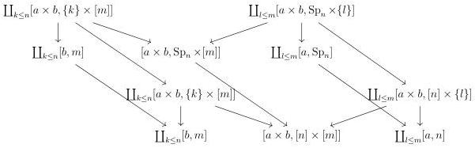
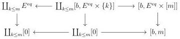
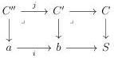

4.2. BASIC CONSTRUCTIONS

Suppose now that $f$ is of shape $[a, \mathrm{Sp}_n] \to [a, n]$. According to lemma 4.2.1.48, the morphism $f \times [b, m]$ is the colimit in depth of the diagram

The lemma 4.2.1.49 implies that $\mathrm{Sp}_n \times [m] \to [n] \times [m]$ is in $\widehat{\mathrm{W}}_1$. Combined with lemma 1.1.3.6, this implies that all the morphisms in depth are in $\widehat{\mathrm{M}}$. By stability by colimit, so is $f \times [b, m]$.

It remains to show the case $f = E^{eq} \to [0]$. According to lemma 4.2.1.48, the morphism $f \times [b, m]$ is the horizontal colimit of the diagram

The lemma 4.2.1.49 implies that $E^{eq} \times [m] \to [m]$ is in $\widehat{\mathrm{W}}_1$. Combined with lemma 1.1.3.6, this implies that all the vertical morphisms are in $\widehat{\mathrm{M}}$. By stability by colimit, so is $f \times [b, m]$.

**Corollary 4.2.1.50.** Let $C$ be an $(\infty, \omega)$-category, $S$ an $\infty$-groupoid, and $f : C \to S$ any morphism. The functor $f^* : (\infty, \omega)\text{-cat}_{/S} \to (\infty, \omega)\text{-cat}_{/C}$ preserves colimits.

*Proof.* As $\mathrm{Psh}^\infty(\Theta)$ is locally cartesian closed, we just have to verify that for any cartesian squares:

if $i$ is in $\mathrm{W}$, then $j$ is in $\widehat{\mathrm{W}}$. Suppose given such cartesian squares. As $b$ is a globular form, $\tau_0^i(b) \sim 1$ and as $S$ is an $\infty$-groupoid, there exists an object $s$ of $S$ such that the

197