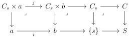
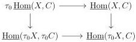
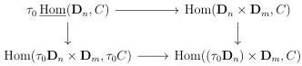
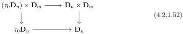

CHAPTER 4. THE \((\infty,1)\)-CATEGORY OF \((\infty,\omega)\)-CATEGORIES

morphism \( b \to S \) factor through \( \{s\} \to S \). If we denote by \( C_s \) the fiber of \( f \) in \( \{s\} \), the morphisms \( i \) and \( j \) then fit in the following cartesian squares:

The proposition 4.2.1.47 implies that \( j \) verifies the desired property, which concludes the proof.

The following proposition implies that a natural transformation is an equivalence if and only if it is pointwise one.

Proposition 4.2.1.51. For any \((\infty, \omega)\)-categories \(X\) and \(C\), the following natural square is cartesian:

Proof. As \(\underline{\mathrm{Hom}} (\_, C)\) sends colimits to limits, we can suppose that \(X\) is of shape \(\mathbf{D}_n\) for \(n\geq 0\). Eventually, proposition 4.2.1.9 implies that pullbacks are detected on globes. We then have to show that for any integer \(m\), the following square is cartesian:

To this extent, we claim that the following square is cocartesian in  \( (\infty,\omega) \) -cat:

Applying the functor \(\underline{\mathrm{Hom}} (\_, C)\) it will prove the desired property. To show the cocartesianess of (4.2.1.52), remark that if either \(n\) or \(m\) is null, this is trivial. If not, proposition 4.2.1.26 states that \(\mathbf{D}_n\times \mathbf{D}_m\) is the colimit of the span:

\[
[ \mathbf {D} _ {n - 1}, 1 ] \vee [ \mathbf {D} _ {m - 1}, 1 ] \leftarrow [ \mathbf {D} _ {n - 1} \times \mathbf {D} _ {m - 1}, 1 ] \rightarrow [ \mathbf {D} _ {m - 1}, 1 ] \vee [ \mathbf {D} _ {n - 1}, 1 ]
\]

198