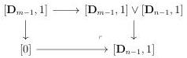
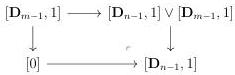
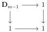
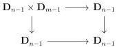

4.2. BASIC CONSTRUCTIONS

Using the two cartesian squares

this implies that the pushout of the upper span of (4.2.1.52) is then the colimit of the diagram:

\[
[ \mathbf {D} _ {n - 1}, 1 ] \leftarrow [ \mathbf {D} _ {n - 1} \times \mathbf {D} _ {m - 1}, 1 ] \rightarrow [ \mathbf {D} _ {n - 1}, 1 ] \tag {4.2.1.53}
\]

The proposition 4.2.1.42 states that the square

is cocartesian. Combined with proposition 4.2.1.47, this implies that the square

is cocartesian. As a consequence, the colimit of the span (4.2.1.53), and so of the upper span of (4.2.1.52), is  \( [D_{n-1},1]\sim D_{n} \) , which concludes the proof. □

4.2.1.54. In paragraph 1.1.1.5, for any subset S of  \( N^{*} \) , we have defined the duality  \( (\_)^{S}:(0,\omega) \) -cat  \( \rightarrow(0,\omega) \) -cat. These functors restrict to functors  \( \Theta\rightarrow\Theta \)  that induce by extension by colimit functors

\[
(\_) ^ {S}: \mathrm{Psh} ^ {\infty} (\Theta) \to \mathrm{Psh} ^ {\infty} (\Theta)
\]

which are once again called dualities. It is easy to see that this functor preserves  \( (\infty,\omega) \) -categories and then induces functors

\[
(\_) ^ {S}: (\infty , \omega) \text {-cat} \to (\infty , \omega) \text {-cat}.
\]

In particular, we have the odd duality  \( (\_)^{op} \) , corresponding to the set of odd integer, the even duality  \( (\_)^{co} \) , corresponding to the subset of non negative even integer, the full duality  \( (\_)^{\circ} \) , corresponding to  \( N^{*} \)  and the transposition  \( (\_)^{t} \) , corresponding to the singleton  \( \{1\} \) . Eventually, we have equivalences

\[
((\_) ^ {c o}) ^ {o p} \sim (\_) ^ {\circ} \sim ((\_) ^ {o p}) ^ {c o}.
\]

199