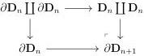

CHAPTER 4. THE \((\infty,1)\)-CATEGORY OF \((\infty,\omega)\)-CATEGORIES

4.2.1.55. A morphism $f : C \to D$ is an *epimorphism* if it is in the smallest cocomplete $\infty$-groupoid of arrows of $(\infty, \omega)$-cat that includes the codiagonal $\mathbf{D}_n \coprod \mathbf{D}_n \to \mathbf{D}_n$ for any $n \geq 0$. A morphism is a *monomorphism* if it has the unique right lifting property against epimorphisms.

A morphism $i : C \to D$ is then a monomorphism if and only if for any $n$, $C_n \to D_n$ is a monomorphism. The small object argument induces a factorization system:

$$
C \to \operatorname{Im} i \to D \tag{4.2.1.56}
$$

of any morphism $i : C \to D$, where the left map is an epimorphism, and the right one is a monomorphism. The object $\operatorname{Im} i$ is called the *image of i*. We then have by construction the following result:

**Proposition 4.2.1.57.** *A morphism is an equivalence if and only if it is both a monomorphism and a epimorphism.*

**Proposition 4.2.1.58.** *The image is stable under the cartesian product.*

*Proof.* One has to show that both epimorphisms and monomorphisms are stable under the functor $\_ \times A$ for $A$ any $(\infty, \omega)$-category. For monomorphisms, it is a direct consequence of the fact that this notion has been defined with a right lifting property. For epimorphisms, as $\_ \times A$ commutes with colimit, we can reduce to show that for any $n$,

$$
(\mathbf{D}_n \coprod \mathbf{D}_n) \times A \sim \mathbf{D}_n \times A \coprod \mathbf{D}_n \times A \to \mathbf{D}_n \times A
$$

is an epimorphism. However, the $\infty$-groupoid of object $B$ such that $B \coprod B \to B$ is an epimorphism is closed by colimits and contains globes. This $\infty$-groupoid then contains all the object and so in particular $\mathbf{D}_n \times A$. $\square$

**Lemma 4.2.1.59.** *For any integer $n$, the projection $\mathbb{I} : \mathbf{D}_{n+1} \to \mathbf{D}_n$ is an epimorphism.*

*Proof.* Remark first that we have a cocartesian square:

As the left hand morphism is an epimorphism, so is the right one. By stability by left cancellation, this implies that $\partial \mathbf{D}_{n+1} \to \mathbf{D}_n$ is an epimorphism. Now, the map $\mathbb{I}$ can be

200