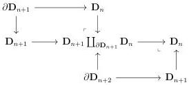
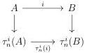

4.2. BASIC CONSTRUCTIONS

factored as:

which directly implies that $\mathbb{I}$ is an epimorphism.

**Proposition 4.2.1.60.** *For any integer $n$, the canonical natural transformation $id \to \tau_n^i$ is pointwise an epimorphism.*

*Proof.* This is a direct consequence of lemma 4.2.1.59.

**Proposition 4.2.1.61.** *For any integer $n$, any $(\infty, n)$-category $C$, and any $(\infty, \omega)$-category $D$, the canonical morphisms*

$$\alpha : \coprod_{C_n} \mathbf{D}_n \to C \qquad \beta : \coprod_{(n,D_n)} \mathbf{D}_n \to D$$

*are epimorphisms.*

*Proof.* Let $I$ be the image of $\alpha$. We are willing to show that the canonical morphism $j : I \to C$ is an equivalence. According to lemma 4.2.1.10, and as $j$ is a monomorphism, we have to show that $j$ has the (non unique) right lifting property against $\emptyset \to \mathbf{D}_k$ for any $k \leq n$. It is sufficient to show that $\alpha$ has the (non unique) right lifting property against $\emptyset \to \mathbf{D}_k$ for any $k \leq n$, which is obviously true. We proceed similarly for $\beta$.

**Proposition 4.2.1.62.** *Let $i : A \to B$ be an epimorphism and $n$ an integer. The canonical square*

*is cocartesian.*

*Proof.* We can reduce to the case where $i$ is $\mathbf{D}_k \coprod \mathbf{D}_k \to \mathbf{D}_k$. If $n \geq k$, it is directly true, and we then suppose $n < k$. In this case, the colimit of the span:

$$\mathbf{D}_n \coprod \mathbf{D}_n \leftarrow \mathbf{D}_k \coprod \mathbf{D}_k \to \mathbf{D}_k$$

is $\mathbf{D}_n \coprod_{\mathbf{D}_k} \mathbf{D}_n$. The proposition 4.2.1.42 implies that this pushout is $\mathbf{D}_n$, which concludes the proof.

201