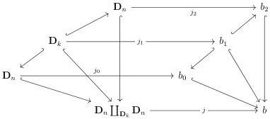
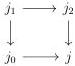

4.2. BASIC CONSTRUCTIONS

Lemma 4.2.2.2. The two following full sub \(\infty\)-groupoids of morphisms of \((\infty, \omega)\)-cat are equivalent:

(1) The smallest cocomplete full sub \(\infty\)-groupoid of morphisms containing the family of morphism \(\{\mathbb{I}_{n+1}:\mathbf{D}_{n+1}\to\mathbf{D}_n,\}\) and the family \(\{\nabla_{k,n}:\mathbf{D}_n\to\mathbf{D}_n\coprod_{\mathbf{D}_k}\mathbf{D}_n k\leq n\}\).
(2) The smallest cocomplete full sub \(\infty\)-groupoid of morphisms containing algebraic morphisms of \(\Theta\) (this notion is defined in paragraph 1.1.2.9).

Proof. For any pair of integers  \( k \leq n \) ,  \( I_{n+1} \)  and  \( \nabla_{k,n} \)  are algebraic morphisms. This directly induces the inclusion of the first  \( \infty \) -groupoid in the second one. To conclude, one has to show that every algebraic morphism  \( i : a \to b \)  is contained in the first  \( \infty \) -groupoid.

We proceed by induction on  \( |a| + |b| \) . Suppose first that there exists n such that  \( a = D_{n} \) . In this case two cases have to be considered. Either n > 0 and i factors as  \( D_{n} \xrightarrow{I_{n}} D_{n-1} \xrightarrow{j} b \) . The result then follows by the induction hypothesis. Suppose now that i does not factor though  \( I_{n} \) . In this case, there exists k such that i factors as  \( D_{n} \xrightarrow{\nabla_{k,n}} D_{n} \coprod_{D_{k}} D_{n} \xrightarrow{j} b \) . The unique factorization system between algebraic and globular morphisms given in proposition 1.1.2.11 produces a diagram

where arrows labeled by  \( \hookrightarrow \)  are globular and the other ones are algebraic. Remark that we have a cocartesian square in  \( (\infty,1) \) -category of arrows of  \( (\infty,\omega) \) -cat:

is cocartesian. As  \( j_{0} \) ,  \( j_{1} \)  and  \( j_{2} \)  are in the first  \( \infty \) -groupoid by induction hypothesis, so is j. By stability by composition, the morphism i is then in the first  \( \infty \) -groupoid.

Suppose now that the domain of  \( i : a \to b \)  is not a globe. Using once again the unique factorization system between algebraic and globular, we can construct a functor  \( \mathrm{Sp}_{a} \to \mathrm{Arr}(\Theta) \)  whose value on  \( D_{n} \hookrightarrow a \)  is given by the unique algebraic morphism j

203