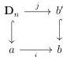
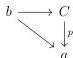
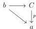
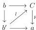

CHAPTER 4. THE $(\infty, 1)$-CATEGORY OF $(\infty, \omega)$-CATEGORIES

fitting in a commutative square

where arrows labeled by $\hookrightarrow$ are globular. By induction hypothesis, $j$ is in the first $\infty$-groupoid. The colimit of $\mathrm{Sp}_a \to \mathrm{Arr}(\Theta) \to \mathrm{Arr}((\infty, \omega)\text{-cat})$ is then in the first $\infty$-groupoid. As this colimit is $i$, this concludes the proof. $\square$

**Proposition 4.2.2.3.** *A morphism $f : X \to Y$ is a discrete Conduché functor if and only if it as the unique right lifting property against algebraic morphism of $\Theta$ (this notion is defined in paragraph 1.1.2.9).*

*Proof.* Given a morphism $f$, the full sub $\infty$-groupoid of morphisms having the unique left lifting property against $f$ is cocomplete. The result is then a direct implication of lemma 4.2.2.2. $\square$

**Example 4.2.2.4.** The proposition 1.1.2.11 implies that a morphism $a \to b$ between globular sums is a discrete Conduché functor if and only if it is globular.

**Lemma 4.2.2.5.** *Let $p : C \to a$ be discrete Conduché functor with $a$ a globular sum. We denote by $(\Theta_{/p})^{Cd}$ the full sub $(\infty, 1)$-category of $\Theta_{/p}$ whose objects are triangles*

*where every arrow is a discrete Conduché functor. The canonical inclusion of $(\infty, 1)$-category $\iota : (\Theta_{/p})^{Cd} \to \Theta_{/p}$ is final.*

*Proof.* To prove this statement, we will endow $\iota$ with a structure of right deformation retract. We then first build a right inverse of $\iota$. Any triangle

induces a diagram of shape

204