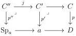
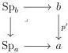
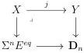

4.2. BASIC CONSTRUCTIONS

where $b'$ is obtained in factorizing $b \to a$ in a algebraic morphism followed by a globular morphism, and $l$ comes from the unique right lifting property of $p$ against algebraic morphisms. By right cancellation, this implies that $l$ is a discrete Conduché functor.

As these two operations are functorial, this defines a retraction $r: \Theta_{/p} \to (\Theta_{/p})^{Cd}$ sending the triangle spotted by $b, C$ and $a$ to the triangle spotted by $b', C$ and $a$. Moreover, this retraction comes along with a natural transformation $id \to r\iota$. As right deformation retracts are final, this concludes the proof.

**Lemma 4.2.2.6.** *Let $p: C \to D$ be a discrete Conduché functor. Then for any globular sums $a$, and any cartesian squares in $\mathrm{Psh}^{\infty}(\Theta)$:*

*the morphism $j$ is in $\widehat{\mathrm{W}_{\mathrm{Seg}}}$.*

*Proof.* By stability under pullback, the morphism $p'$ is a discrete Conduché functor. Taking the notations of lemma 4.2.2.5, $p'$ is equivalent to $\operatorname{colim}_{(\Theta_{/p})^{Cd}} b \to a$ where this colimit is taken in $\mathrm{Psh}^{\infty}(\Theta)_{/a}$. As $\mathrm{Psh}^{\infty}(\Theta)$ is locally cartesian closed and as $\widehat{\mathrm{W}}$ is by definition closed by colimits, we can then reduce to the case where $p'$ is a discrete Conduché functor between globular sums, i.e a globular morphism $b \to a$. In this case, the following canonical square is a pullback

and this concludes the proof.

**Lemma 4.2.2.7.** *Consider a cartesian square*

*in $\mathrm{Psh}^{\infty}(\Theta)$. The morphism $j$ is in $\widehat{\mathrm{W}}$.*

*Proof.* If we are in the case $n = 0$, this directly follows from the preservation of $\mathrm{W}$ by cartesian product, demonstrated in the proof of proposition 4.2.1.47. We now suppose

205