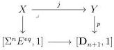
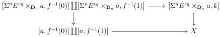
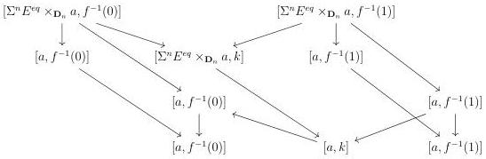
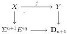
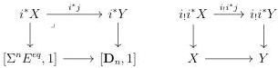

CHAPTER 4. THE \((\infty,1)\)-CATEGORY OF \((\infty,\omega)\)-CATEGORIES

the result is true at stage \( n \), and we first show that for any square

in \(\mathrm{Psh}^{\infty}(\Delta[\Theta])\), \(j\) is in \(\widehat{\mathrm{M}}\). As \(\mathrm{Psh}^{\infty}(\Delta[\Theta])\) is locally cartesian closed and \(\widehat{\mathrm{M}}\) closed under colimits, one can suppose that \(Y\) is of shape \([a,k]\) and we denote \(f:[k]\to [1]\) the morphism induced by \(p\). By stability under pullback, \(X\) is then set-valued. Furthermore, we can then check in \(\mathrm{Psh}(\Delta[\Theta])\) that this presheaf fits in a cocartesian square:

By induction hypothesis \([\Sigma^n E^{eq} \times_{\mathbf{D}_n} a, l] \to [a, l]\) is in \(\widehat{\mathrm{M}}\) for any integer \(l\). As \(X \to [a, k]\) is the colimit in depth of the diagram

this implies that this morphism is in \(\widehat{\mathrm{M}}\).

We now return to  \( \infty \) -presheaves on  \( \Theta \) . We recall that we denote by  \( (i_{!}, i^{*}) \)  the adjunction between  \( \mathrm{Psh}^{\infty}(\Delta[\Theta]) \)  and  \( \mathrm{Psh}^{\infty}(\Theta) \) . Suppose given a cartesian square:

This induces two squares

206