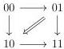
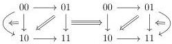
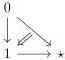
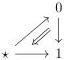
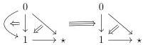
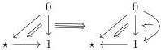

4.3. GRAY OPERATIONS

4.3.1.3. As explained in section 2.2.4, the functor \(\pi_0\) induces canonical equivalences

\[
\pi_ {0} (C \otimes [ 1 ]) \cong \pi_ {0} (C) \otimes [ 1 ] \quad \pi_ {0} (C \star 1) \cong \pi_ {0} (C) \star 1 \quad \pi_ {0} (1 \stackrel {c o} {\star} C) \cong 1 \stackrel {c o} {\star} \pi_ {0} (C)
\]

natural in C. We will show in theorem 4.3.3.26 that the nerve  \( N : (0, \omega) \) -cat  \( \rightarrow (\infty, \omega) \) -cat also preserves the Gray operations. As a consequence, we obtain the following examples of Gray operations:

Example 4.3.1.4. The  \( (\infty,\omega) \) -category  \( D_{1}\otimes[1] \)  corresponds to the polygraph

The \((\infty, \omega)\)-category \(\mathbf{D}_2 \otimes [1]\) corresponds to the polygraph

Example 4.3.1.5. The \((\infty, \omega)\)-categories \(\mathbf{D}_1 \star 1\) and \(1 \stackrel{co}{\star} \mathbf{D}_1\) correspond respectively to the polygraphs:

The \((\infty, \omega)\)-categories \(\mathbf{D}_2 \star 1\) and \(1 \stackrel{co}{\star} \mathbf{D}_2\) correspond respectively to the polygraphs:

4.3.1.6. In section 2.3 are shown several equations fulfilled by the Gray cylinder, the Gray cone, and the Gray o-cone, that we recall here. For every  \( (\infty,\omega) \) -category C, there is a natural identification between  \( [C,1]\otimes[1] \)  and the colimit of the following diagram

\[
[ 1 ] \vee [ C, 1 ] \longleftarrow [ C \otimes \{0 \}, 1 ] \longrightarrow [ C \otimes [ 1 ], 1 ] \longleftarrow [ C \otimes \{1 \}, 1 ] \longrightarrow [ C, 1 ] \vee [ 1 ] \tag {4.3.1.7}
\]

There is also a natural identification between \(1 \stackrel{co}{\star} [C, 1]\) and the colimit of the diagram

\[
[ 1 ] \vee [ C, 1 ] \longleftarrow [ C, 1 ] \longrightarrow [ C \star 1, 1 ] \tag {4.3.1.8}
\]

209