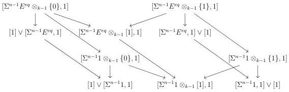

4.3. GRAY OPERATIONS

We then proceed by induction on $k$. The cases $k = 0$ and $k = 1$ are trivial as $\_ \otimes_0 [1]$ is the identity and $\_ \otimes_1 [1]$ is the tensor product with $[1]$.

Suppose the result is true at the stage $k$ for $k > 1$. If $n = 0$, remark that $E^{eq} \otimes_k [1]$ (resp. $1 \otimes_k [1]$) is equivalent to $E^{eq} \otimes [1]$ (resp. $1 \otimes [1]$) and the morphism is then in $\widehat{\mathrm{W}}$. Now, if $n > 0$, formula (4.3.1.12) implies that $(\Sigma^n E^{eq}) \otimes_k [1] \to (\Sigma^n 1) \otimes_k [1]$ is the colimit in depth of the following diagram:

by induction hypothesis, and using lemma 1.1.3.6, all the morphisms in depth are in $\widehat{\mathrm{W}}$, and so is their colimit.

The functor $\_ \otimes [1]_k$ then admits a right adjoint

$$(\_)^{[1]_k} : (\infty, \omega)\text{-cat} \to (\infty, \omega)\text{-cat}.$$

4.3.1.14. We now describe a last operation that will play an essential role in the definition of lax colimit and lax limit. For any $C : (\infty, \omega)\text{-cat}$, we denote by $m_C$ the colimit preserving functor $(\infty, \omega)\text{-cat} \to (\infty, \omega)\text{-cat}$ whose value on a representable $[a, n]$ is $[a \times C, n]$. Remark that the assignation $C \mapsto m_C$ is natural in $C$ and that $m_1$ is the identity. We define the colimit preserving functor:

$$(\infty, \omega)\text{-cat} \times (\infty, \omega)\text{-cat} \quad \to \quad (\infty, \omega)\text{-cat}$$

$$(X, Y) \qquad \mapsto \qquad X \ominus Y$$

where for any $(\infty, \omega)$-category $C$ and any element $[b, n]$ of $\Delta[\Theta]$, $X \ominus [b, n]$ is the following pushout:

$$\coprod_{k \le n} m_b(C \otimes \{k\}) \longrightarrow m_b(C \otimes [n])$$
$$\updownarrow \qquad \qquad \qquad \qquad \qquad \qquad \qquad \qquad \qquad \qquad \qquad \qquad \qquad \qquad \qquad \qquad \qquad \qquad \qquad \qquad \qquad \qquad \qquad \qquad \qquad \qquad \qquad \qquad \qquad \qquad \qquad \qquad \qquad \qquad$$
$$\coprod_{k \le n} m_1(C \otimes \{k\}) \longrightarrow C \ominus [b, n]$$

211