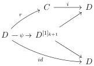
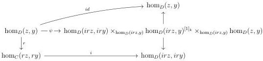
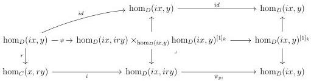
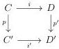

CHAPTER 4. THE \((\infty,1)\)-CATEGORY OF \((\infty,\omega)\)-CATEGORIES

is a right (resp. left) \(k\)-Gray deformation retract, whose retract is given by

\[
\hom_ {D} (i x, y) \xrightarrow {r} \hom_ {C} (x, r y)
\]

\[
(r e s p. \hom_ {D} (x, i y) \xrightarrow {r} \hom_ {C} (r x, y))
\]

Proof. By currying \(\psi\), this induces a diagram

For any pair of objects \((z,y)\) of \(D\), according to formula (4.3.1.12), this induces a diagram

If \(z\) is of shape \(ix\), the diagram becomes

By decurrying, this induces a morphism \(\phi : \mathrm{hom}_D(ix, y) \otimes_k [1] \to \mathrm{hom}_D(ix, y)\). We leave the reader verify that the triple \((\psi_{y_1}i, r, \phi)\) is a right \(k\)-Gray deformation retract structure. We proceed similarly for the other case.

Proposition 4.3.2.10. For any left (resp. right) \((k + 1)\)-Gray deformation retract between \(p\) and \(p'\):

214