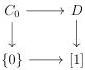
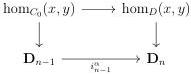
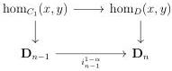

CHAPTER 4. THE \((\infty,1)\)-CATEGORY OF \((\infty,\omega)\)-CATEGORIES

such that \( p \to p' \) is a left \( (n + 1) \)-Gray deformation retract (resp. a right \( (n + 1) \)-Gray deformation retract). Let \( C_1 \) be the \( (\infty, \omega) \)-category fitting in the pullback

\[
\begin{array}{c} C _ {1} \xrightarrow {} D \\ p \Big \downarrow \quad \quad \quad \quad \quad \quad \quad \quad \quad \quad \quad \quad \quad \quad \quad \quad \quad \quad \quad \quad \quad \quad \quad \quad \quad \quad \quad \quad \quad \quad \quad \quad \quad \quad \quad \quad \quad \quad \quad \quad \quad \quad \quad \quad \quad \quad \quad \quad \quad \quad \text {   (4.3.3.8)   } \\ \mathbf {D} _ {n} \xrightarrow [ i _ {n} ^ {1 - \alpha} ]{} \mathbf {D} _ {n + 1} \end{array}
\]

Then if \(C_0\) and \(C_1\) are strict, so is \(D\).

Proof. We denote by  \( (i, r, \phi) \)  the deformation retract structure corresponding to  \( C_{0} \to D \) . We show this result by induction, and let's start with the case n = 0. This corresponds to the case where  \( C_{0} \to D \)  fits in a pullback diagram.

Let \( x, y \) be two objects of \( D \). Suppose first that \( x \) and \( y \) are over the same object of [1]. In this case, \( \mathrm{hom}_D(x, y) \) is equivalent to either \( \mathrm{hom}_{C_0}(x, y) \) or \( \mathrm{hom}_{C_1}(x, y) \) and is then strict. If \( x \) is over 1 and \( y \) over 0, the \( \infty \)-groupoid \( \mathrm{hom}_D(x, y) \) is empty. If \( x \) is over 0 and \( y \) is over 1, \( \mathrm{hom}_D(x, y) \) is equivalent to \( \mathrm{hom}_{C_0}(x, ry) \) according to 4.3.2.9 and is then strict by hypothesis. Eventually, \( \tau_0(D) \) is equivalent to \( \tau_0(C_1) \) and is then a set. According to 4.3.3.1, this implies that \( D \) is strict.

Suppose now the result is true at stage  \( (n-1) \) . Let  \( p'\to p \)  be a square verifying the condition. Remark that, at the level of objects, the inclusion  \( C_{0}\to D \) , its retract, and its deformation, are the identity.

Let \( x \) and \( y \) be two objects of \( D \). As before, the only interesting case is when \( x \) is over 0 and \( y \) is over 1. In this case, applying \( \mathrm{hom}(\_, \_) \) to the square (4.3.3.7), we get a cartesian square

which is a right n-Gray deformation retract according to proposition 4.3.2.9. Applying  \( \mathrm{hom}(\_, \_) \)  to the square (4.3.3.8), we get a cartesian square

218