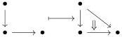
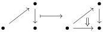
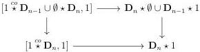

4.3. GRAY OPERATIONS

As $C_1$ is strict, so is $\hom_{C_1}(x,y)$. We can then apply the induction hypothesis, which implies that $\hom_D(x,y)$ is strict. As $\tau_0 D$ is equivalent to $\tau_0 C_0$, it is a set. We can apply proposition 4.3.3.1 which implies that $D$ is strict. $\square$

### 4.3.3.9. For an integer $n > 0$, we define by induction

- a left $(n + 1)$-Gray retract structure for the inclusion

$$
\mathbf{D}_n \star \emptyset \cup \mathbf{D}_{n-1} \star 1 \rightarrow \mathbf{D}_n \star 1 \tag{4.3.3.10}
$$

where the gluing is performed along $i_n^\alpha : \mathbf{D}_{n-1} \star \emptyset \rightarrow \mathbf{D}_n \star \emptyset$ with $\alpha$ being $+$ if $n$ is odd and $-$ if not,

- a right $(n + 1)$-Gray retract structure for the inclusion

$$
1 \stackrel{co}{\star} \mathbf{D}_{n-1} \cup \emptyset \stackrel{co}{\star} \mathbf{D}_n \rightarrow 1 \stackrel{co}{\star} \mathbf{D}_n \tag{4.3.3.11}
$$

where the gluing is performed along $i_n^\alpha : \emptyset \stackrel{co}{\star} \mathbf{D}_{n-1} \rightarrow \emptyset \stackrel{co}{\star} \mathbf{D}_n$ with $\alpha$ being $-$ if $n$ is odd and $+$ if not.

If $n = 1$, the first morphism corresponds to the inclusion

and the second one to the inclusion:

The propositions 4.3.2.12 and 4.3.2.5 imply that the first morphism is a left 2-Gray deformation retract and the second one a right 2-Gray deformation retract. Suppose now that these two morphisms are constructed at stage $n$. The formula (4.3.1.8) implies that $\mathbf{D}_{n+1} \star \emptyset \cup \mathbf{D}_n \star 1 \rightarrow \mathbf{D}_{n+1} \star 1$ fits in the cocartesian square

The induction hypothesis and the propositions 4.3.2.11 and 4.3.2.5 endow this morphism with a left $(n + 2)$-Gray retract structure. We constructs similarly the right $(n + 2)$-Gray retract structure for the inclusion $1 \stackrel{co}{\star} \mathbf{D}_{n-1} \cup \emptyset \stackrel{co}{\star} \mathbf{D}_n \rightarrow 1 \stackrel{co}{\star} \mathbf{D}_n$.

219