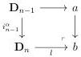
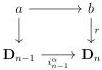
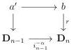
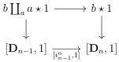
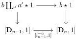

CHAPTER 4. THE \((\infty,1)\)-CATEGORY OF \((\infty,\omega)\)-CATEGORIES

Proposition 4.3.3.12. Let $C$ be a strict $(\infty, \omega)$-category, $a$ a globular sum, and $f : a \to C$ any morphism. The $(\infty, \omega)$-categories $C \coprod_{a} a \star 1$ and $1 \stackrel{co}{\star} a \coprod_{a} C$ are strict.

Proof. We will prove the result by induction on the number of non-identity cells of $a$. Remark that for any globular sum $b$, there exists a globular sum $a$, an integer $n$, and a cartesian square composed of globular morphism

with $\alpha = +$ if $n$ is odd, and $\alpha = -$ if $n$ is even, and such that $l$ admits a retract $r$. As $i_{n-1}^{\alpha}$ is globular, the pullback along this morphism preserves colimits according to theorem 4.2.2.9. We then have a cartesian square:

We also define $a'$ as the pullback:

and remark that $a'$ is a globular sum. Eventually, we fix a morphism $b \to C$. As $a$ and $a'$ are sub globular sum of $b$, the number of non-identity cells in each of them is strictly less than the one of $b$. We then suppose that for any strict $(\infty, \omega)$-category $C$, and any morphism $b \to C$, the two induced $(\infty, \omega)$-category $C \coprod_{a} a \star 1$ and $C \coprod_{a'} a' \star 1$ are strict, and we are willing to show that $C \coprod_{b} b \star 1$ also is. We claim that the two following squares are cartesian

According to theorem 4.3.3.5, proposition 4.3.3.2, and the induction hypothesis, all the objects of these squares are strict. We can show the cartesianess in $(0, \omega)$-cat, where it follows from lemma 1.2.3.16. As morphism $[i_{n-1}^{-}, 1], [i_{n-1}^{+}, 1]$ are globular, the pullback

220