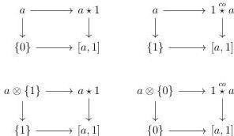
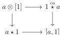
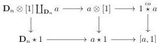
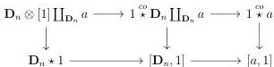

CHAPTER 4. THE $(\infty, 1)$-CATEGORY OF $(\infty, \omega)$-CATEGORIES

*Proof.* The five squares of the second diagram are cocartesian by construction. Furthermore, remark that all the objects appearing in the squares

are strict according to theorem 4.3.3.5 and proposition 4.3.3.2. One can the show their cartesianess in $(0, \omega)$-cat, where it follows from proposition 1.2.3.15.

By stability by right cancellation of cartesian square, it remains to show that the square

is cartesian. Using the fact that pullback along $1 \stackrel{co}{\star} a \rightarrow [a, 1]$ preserves colimits as stated by corollary 5.2.3.12, it is sufficient to show that for any globular morphism $\mathbf{D}_n \rightarrow a$, the outer square of the diagram

is cartesian. Remark that this outer square also factors as:

The cartesianess of the left square is a consequence of the preservation of colimit of the pullback along the morphism $\mathbf{D}_n \star 1 \rightarrow [\mathbf{D}_n, 1]$, and of the cartesian square provided by proposition 1.2.3.15. We recall that we can indeed use the last proposition, as we already show in lemma 4.3.3.3 that $\mathbf{D}_n \otimes [1]$, $1 \stackrel{co}{\star} \mathbf{D}_n$ and $\mathbf{D}_n \star 1$ are strict.

222