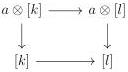
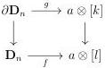
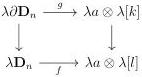

CHAPTER 4. THE \((\infty,1)\)-CATEGORY OF \((\infty,\omega)\)-CATEGORIES

Proof. If K is [n], an easy induction using proposition 4.3.3.17 shows the result. In the general case, remark that K is the special colimit of the diagram  \( \pi : \Delta_{/K}^{\hookrightarrow} \to \mathrm{Psh}^{\infty}(\Delta) \)  where  \( \Delta_{/K}^{\hookrightarrow} \)  is the category whose objects are monomorphisms  \( [n] \to K \)  and arrows are monomorphisms between domains making the induced triangle commutative, while  \( \pi \)  sends  \( [n] \to K \)  to [n]. We claim that the natural transformation

\[
a \otimes \pi \rightarrow \pi
\]

is cartesian. Proposition 4.2.1.24 then implies that \( a \otimes \pi \) has a special colimit. Moreover, \( a \otimes \pi \) fulfills the hypotheses of the third assertion of lemma 4.1.1.6. Its colimit is then strict, and this concludes the proof of the first assertion.

To demonstrate the cartesianess of the natural transformation  \( a \otimes \pi \to \pi \) , one has to show that for any monomorphism  \( i : [k] \to [l] \) , the induced square

is cartesian.

As \([k] \to [l]\) is fully faithful, so is \([k] \times_{[l]} a \otimes [l] \to a \otimes [l]\). If we manage to show that \(a \otimes [k] \to a \otimes [l]\) is fully faithful, it will imply by right cancelation that \(a \otimes [k] \to [l] \coprod_{[k]} a \otimes [l]\) is also fully faithful, and as this morphism is obviously surjective on objects it will conclude the proof.

We then have to show that for any integer n > 0, any square of shape

admits a unique lifting. Suppose given such square. Using the Steiner theory recalled in 1.2.1, it is equivalent show that the induced square of augmented directed complexes:

admits a unique lifting. We recall that the basis of  \( \lambda D_{n} \)  is given by the graded set:

\[
(B _ {\lambda \mathbf {D} _ {n}}) _ {k} := \left\{ \begin{array}{l l} \{e _ {k} ^ {-}, e _ {k} ^ {+} \} & \text {if k <   n} \\ \{e _ {n} \} & \text {if k = n} \\ \emptyset & \text {if k > n} \end{array} \right.
\]

224