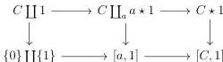
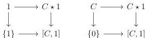
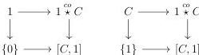
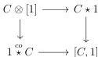
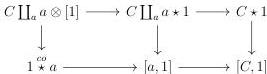

CHAPTER 4. THE $(\infty, 1)$-CATEGORY OF $(\infty, \omega)$-CATEGORIES

*Proof.* The five squares of the second diagram are cocartesian by construction.

If $C$ is empty, all the considered squares are cartesian. We can then suppose that there exists a globular sum $a$, and a morphism $a \to C$. We claim that the two following squares are cartesian.

The cartesianess of the left square is a consequence of proposition 4.3.3.15 and of the fact that $\{0\} \to [a, 1]$ and $\{1\} \to [a, 1]$ are discrete Conduché functors and so pullback along them preserves colimits. The cartesianess of the right square is a consequence of the preservation of Gray operations by the full duality stated in corollary 4.3.3.21, and of the cartesian square provided by corollary 5.2.3.11. The two following squares are then cartesian:

As the duality $(\_)^\circ$ preserves limits, and combined with corollary 4.3.3.21, this implies that the two following squares are also cartesian:

By stability by right cancellation of cartesian square, it remains to show that the square

is cartesian. Consider the two following squares

We already demonstrate that the right one is cartesian and the lemma 4.3.3.16 states that the left one is also cartesian. The outer square is then cartesian.

228