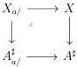

5.1. MARKED \((\infty, \omega)\)-CATEGORIES

In the fourth subsection we study *smooth* and *proper* morphisms and we obtain the following expected result:

**Proposition 5.2.4.16.** *For a morphism $X \to A^{\sharp}$, and an object $a$ of $A$, we denote by $X_{/a}$ the marked $(\infty, \omega)$-category fitting in the following cartesian squares.*

*We denote by $\bot : (\infty, \omega)$-cat$_{\mathfrak{m}} \to (\infty, \omega)$-cat the functor sending a marked $(\infty, \omega)$-category to its localization by marked cells.*

(1) *Let $E$, $F$ be two elements of $(\infty, \omega)$-cat$_{\mathfrak{m}/A^{\sharp}}$ corresponding to morphisms $X \to A^{\sharp}$, $Y \to A^{\sharp}$, and $\phi : E \to F$ a morphism between them. We denote by $\mathbf{F}E$ and $\mathbf{F}F$ the left cartesian fiborant replacement of $E$ and $F$.*

*The induced morphism $\mathbf{F}\phi : \mathbf{F}E \to \mathbf{F}F$ is an equivalence if and only if for any object $a$ of $A$, the induced morphism*

$$
\bot X_{/a} \to \bot Y_{/a}
$$

*is an equivalence of $(\infty, \omega)$-categories.*

(2) *A morphism $X \to A^{\sharp}$ is initial if and only if for any object $a$ of $A$, $\bot X_{/a}$ is the terminal $(\infty, \omega)$-category.*

Finally, in the last subsection, for a marked $(\infty, \omega)$-category $I$, we define and study a (huge) $(\infty, \omega)$-category $\underline{\mathrm{LCart}}^c(I)$ that has classified left cartesian fibrations as objects and morphisms between classified left cartesian fibrations as arrows.

**Cardinality hypothesis.** We fix during this chapter two Grothendieck universes $\mathbf{V} \in \mathbf{W}$, such that $\omega \in \mathbf{U}$. When nothing is specified, this corresponds to the implicit choice of the cardinality $\mathbf{V}$. We then denote by Set the $\mathbf{W}$-small 1-category of $\mathbf{V}$-small sets, $\infty$-grd the $\mathbf{W}$-small $(\infty, 1)$-category of $\mathbf{V}$-small $\infty$-groupoids and $(\infty, 1)$-cat the $\mathbf{W}$-small $(\infty, 1)$-category of $\mathbf{V}$-small $(\infty, 1)$-categories.

## 5.1 Marked $(\infty, \omega)$-categories

### 5.1.1 Definition of marked $(\infty, \omega)$-categories

**5.1.1.1.** *A marked $(0, \omega)$-category is a pair $(C, tC)$ where $C$ is an $(0, \omega)$-category and $tC := (tC_n)_{n>0}$ is a sequence of subsets of $C_n$, containing identities, stable by composition*

233