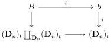
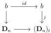
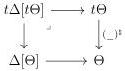

5.1. MARKED \((\infty, \omega)\)-CATEGORIES

the top horizontal morphism is in \(\widehat{I}\). Using once again the locally cartesian closeness of \(\mathrm{Psh}^{\infty}(t\Theta)\), it is sufficient to show that for any integer \(n > 0\) and for any morphism \(j:b\to (\mathbf{D}_n)_t\) between elements of \(t\Theta\), the morphism \(i\) appearing in the following cartesian square of \(\mathrm{Psh}^{\infty}(t\Theta)\) is an equivalence or is in \(I\):

Two cases have to be considered. If \( j \) is the identity this is trivially true. If \( j \) is any other morphism, it factors through \( \mathbf{D}_n \to (\mathbf{D}_n)_t \), and the following square is cartesian

This implies that \( B \) is equivalent to \( b \coprod_{b} b \sim b \), and \( i \) is then the identity.

5.1.1.7. For a stratified  \( \infty \) -presheaf X on  \( \Theta \) , we denote by  \( tX_{n} \)  the  \( \infty \) -groupoid  \( X((\mathbf{D}_{n})_{t}) \) . A stratified  \( \infty \) -presheaves on  \( \Theta \)  is then the data of a pair  \( (X, tX) \)  such that  \( X \in \mathrm{Psh}^{\infty}(\Theta) \)  and  \( tX := (tX_{n})_{n>0} \)  is a sequence of  \( \infty \) -groupoid such that for any n > 0,  \( tX_{n} \)  is a full sub  \( \infty \) -groupoid of  \( X_{n} \)  including all units.

For  \( X \in \mathrm{Psh}^{\infty}(\Theta) \) , we define  \( X^{\sharp} := (X, (X_{n})_{n>0}) \)  and  \( X^{\flat} := (X, (\mathbb{I}(X_{n-1})_{n>0}) \)  and we have an adjoint triple

\[
(\_) ^ {\flat}: \mathrm{Psh} ^ {\infty} (\Theta) \xrightarrow [ \longleftarrow ]{\perp} \mathrm{tPsh} ^ {\infty} (\Theta): (\_) ^ {\natural} \qquad (\_) ^ {\natural}: \mathrm{tPsh} ^ {\infty} (\Theta) \xrightarrow [ \longleftarrow ]{\perp} \mathrm{Psh} (\Theta): (\_) ^ {\sharp}
\]

where \((\_)^{\natural}\) is the obvious forgetful functor.

5.1.1.8. We define the category \( t\Delta[t\Theta] \) as the pullback

The objects of \( t\Delta[t\Theta] \) then are of shape \( [1]^{\sharp} \) or \( [a,n] \) with \( a\in t\Theta \) and \( n\in \Delta \). The \( (\infty ,1) \)-category of stratified presheaves on \( \Delta [\Theta ] \), denoted by \( \mathrm{tPsh}^{\infty}(\Delta [\Theta ]) \), is the full sub \( (\infty ,1) \)-category of \( \mathrm{Psh}^{\infty}(t\Delta [t\Theta ]) \) whose objects correspond to \( \infty \)-presheaves \( X \) such that the induced morphism \( X((\mathbf{D}_n)_t)\to X(\mathbf{D}_n) \) is a monomorphism.

Proposition 5.1.1.9. The \((\infty,1)\)-category \(\mathrm{tPsh}^{\infty}(\Delta[\Theta])\) is locally cartesian closed.

Proof. The proof is almost identical to the one of proposition 5.1.1.6

235