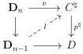
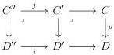

CHAPTER 5. THE \((\infty,1)\)-CATEGORY OF MARKED \((\infty,\omega)\)-CATEGORIES

Proof. Suppose given a marked \(n\)-cell \(v: \mathbf{D}_n \to C^\natural\). As the marking on \(C\) is trivial, this induces a commutative square

that admits a lift \( l \) as \( p^{\sharp} \) is a discrete Conduché functor, which concludes the proof.

Proposition 5.1.1.29. Let \( p: C \to D \) be a discrete Conduché functor between marked \( (\infty, \omega) \)-categories. The pullback functor \( p^* \) preserves colimits.

Proof. As  \( \mathrm{tPsh}^{\infty}(\Theta) \)  is locally cartesian closed, one has to show that for any pair of cartesian squares

if \(i\) is tW, then \(j\) is in \(\widehat{\mathrm{tW}}\). Suppose first that \(i\) is in \(\mathrm{W}_{\mathrm{Sat}}^{\flat}\). According of the lemma 5.1.1.28 the \((\infty, \omega)\)-categories \(C'\) and \(C''\) are of shape \((E)^{\flat}\) and \((E')^{\flat}\) for \(E\) and \(E'\) two \((\infty, \omega)\)-categories. The proposition 4.2.2.8 then implies that \(i\) is in \(\widehat{\mathrm{W}}^{\flat} \subset \widehat{\mathrm{tW}}\). If \(i\) is in \((\mathrm{W}_{\mathrm{Seg}})^{\sharp_n}\) the proof is an easy adaptation of the one of lemma 4.2.2.6.

5.1.1.30. We now give some adaptation of the result on special colimits stated in paragraph 4.2.1.21 to the case of marked  \( (\infty,\omega) \) -categories without proofs, as they are easy modifications.

We denote by \(\iota\) the inclusion of \((\infty, \omega)\)-cat\(_{\mathrm{m}}\) into tPsh\(^{\infty}(\Theta)\). A functor \(F: I \to (\infty, \omega)\)-cat\(_{\mathrm{m}}\) has a special colimit if the canonical morphism

\[
\underset {i: I} {\operatorname{colim}} \iota F (i) \rightarrow \iota (\underset {i: I} {\operatorname{colim}} F (i)) \tag {5.1.1.31}
\]

is an equivalence of stratified presheaves.

Similarly, we say that a functor \(\psi : I \to \mathrm{Arr}((\infty, \omega)\text{-cat}_{\mathrm{m}})\) has a special colimit if the canonical morphism

\[
\underset {i: I} {\operatorname{colim}} \iota \psi (i) \to \iota (\underset {i: I} {\operatorname{colim}} \psi (i))
\]

is an equivalence in the arrow \((\infty,1)\)-category of \(\mathrm{tPsh}^{\infty}(\Theta)\).

Example 5.1.1.32. Let C be a marked  \( (\infty,\omega) \) -category. The canonical diagram  \( t\Theta_{/C} \to (\infty,\omega) \) -cat has a special colimit, given by C.

240