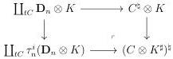
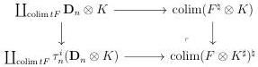
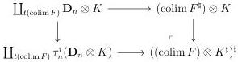
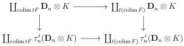

CHAPTER 5. THE \((\infty,1)\)-CATEGORY OF MARKED \((\infty,\omega)\)-CATEGORIES

sending a marked \((\infty, \omega)\)-category \(C\) and a \((\infty, 1)\)-category \(K\) to the marked \((\infty, \omega)\)-category \(C \otimes K^{\sharp}\), such that \((C \otimes K^{\sharp})^{\sharp}\) fits in the cocartesian square

and such that  \( t(C \otimes K^{\sharp})_{n} \)  consists of n-cells lying in the image of the morphism

\[
\tau_ {n - 1} C \otimes K \coprod (t C) _ {n} \otimes K _ {0} \rightarrow (C \otimes K ^ {\sharp}) ^ {\natural}.
\]

Proposition 5.1.2.1. The functor \(\_ \otimes (\_)^{\sharp} : (\infty, \omega)\text{-cat}_{\mathfrak{m}} \times (\infty, 1)\text{-cat} \to (\infty, \omega)\text{-cat}_{\mathfrak{m}}\) preserves colimits.

Proof. By construction, we have two cocartesian squares:

By the preservation of colimit by the Gray tensor product for \((\infty, \omega)\)-categories and by the functor \((_{-})^{\natural}\), we have an equivalence

\[
\operatorname{colim} (F ^ {\natural} \otimes K) \sim (\operatorname{colim} F ^ {\natural}) \otimes K
\]

However, the canonical morphism  \( \operatorname{colim} tF \to t(\operatorname{colim} F) \)  is an epimorphism, and according to proposition 4.2.1.62, the following canonical square is cocartesian

Combined with the first two cocartesian squares, this implies that that  \( \operatorname{colim}(F \otimes K^{\sharp})^{\sharp} \)  and  \( ((\operatorname{colim} F) \otimes K^{\sharp})^{\sharp} \)  are equivalent.

242