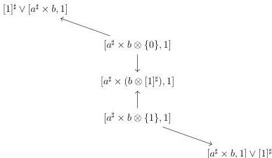
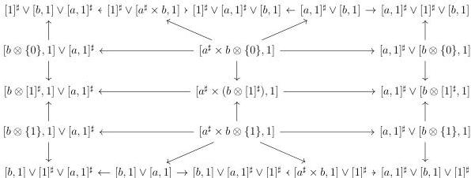

5.1. MARKED $(\infty, \omega)$-CATEGORIES

is the colimit of the diagram

As all these colimits are special and composed of monomorphisms, the objects $([a, 1]^{\sharp} \vee [b, 1]) \otimes [1]^{\sharp}$, $([b, 1]^{\sharp} \vee [a, 1]^{\sharp}) \otimes [1]^{\sharp}$ and $[a^{\sharp} \times b, 1] \otimes [1]^{\sharp}$ are strict. As the colimit (5.1.2.4) is also special, $([a, 1]^{\sharp} \times [b, 1]) \otimes [1]^{\sharp}$ is strict.

All put together, $([a, 1]^{\sharp} \times [b, 1]) \otimes [1]^{\sharp}$ is the colimit of the diagram

Now, using the formula given in proposition 5.1.1.34, and taking the colimit line by

245