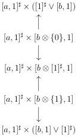
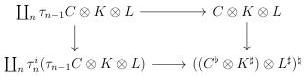
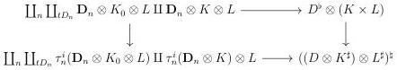

CHAPTER 5. THE \((\infty,1)\)-CATEGORY OF MARKED \((\infty,\omega)\)-CATEGORIES

line of the previous diagram, \(([a,1]^{\sharp}\times [b,1])\otimes [1]^{\sharp}\) is the colimit of the diagram

Using for the last times formula (5.1.3.9), \(([a,1]^{\sharp}\times [b,1])\otimes [1]^{\sharp}\) is equivalent to \([a,1]^{\sharp}\times ([b,1]\otimes [1]^{\sharp})\)

Proposition 5.1.2.5. Let \( D \) be a marked \( (\infty, \omega) \)-category and \( K, L \) two \( (\infty, 1) \)-categories. There is a natural equivalence \( (D \otimes K^{\sharp}) \otimes L^{\sharp} \to D \otimes (K \times L)^{\sharp} \).

Proof. Suppose first that \( D \) is of shape \( C^b \). The proposition 4.2.1.61 implies that \( \coprod_{t(C^b \otimes K^\sharp)^\sharp} \mathbf{D}_n \to (C^b \otimes K^\sharp)^\sharp \) and \( (\coprod_n \tau_{n-1} C \otimes K) \to (C^b \otimes K^\sharp)^\sharp \) have the same image. The proposition 4.2.1.62, then implies that the underlying \( (\infty, \omega) \)-category of \( (C^b \otimes K^\sharp) \otimes L^\sharp \) fits in the cocartesian square

The second assertion of lemma 2.2.2.8 then implies that \(((C^b\otimes K^\sharp)\otimes L^\sharp)^\sharp\) is equivalent to \(C^b\otimes (K\times L)\). For a general marked \((\infty ,\omega)\)-category \(D\), the underlying \((\infty ,\omega)\)-category of \((D^{b}\otimes K^{\sharp})\otimes L^{\sharp}\) then fits by construction in the cocartesian square

Furthermore, the underlying \((\infty ,\omega)\)-category of \(D\otimes (K\times L)^{\sharp}\) fits in the cocartesian

246