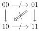
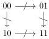
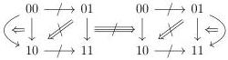
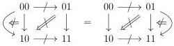

CHAPTER 5. THE \((\infty,1)\)-CATEGORY OF MARKED \((\infty,\omega)\)-CATEGORIES

natural in \( C: (\infty, \omega) \)-cat\(_{\mathrm{m}}\), where all vertical arrows are equivalences. There is an invertible natural transformation

\[
C \star 1 \sim (1 ^ {c o} \star C ^ {\circ}) ^ {\circ}.
\]

Proof. The corollary 4.3.3.21 provides an invertible transformation

\[
(C ^ {\circ} \otimes [ 1 ]) ^ {\circ} \sim (C ^ {\circ}) ^ {\circ} \otimes [ 1 ]
\]

The first assertion then follows from the definition of the Gray tensor product for marked  \( (\infty,\omega) \) -categories. The second assertion is a consequence of the definition of the marked Gray cone and o-cone.

Example 5.1.3.4. In all the following diagrams, marked cells are represented by crossed-out arrows.

The object \(\mathbf{D}_1^\flat \otimes [1]^{\sharp}\) corresponds to the diagram

the object  \( (\mathbf{D}_{1})^{\sharp} \otimes [1]^{\sharp} \)  corresponds to the diagram

the object \(\mathbf{D}_2^\flat \otimes [1]^{\sharp}\) corresponds to the diagram

and the object  \( (\mathbf{D}_{2})_{t} \otimes [1]^{\sharp} \)  corresponds to the diagram

5.1.3.5. We also define the functors

\[
\_ \star 1: (\infty , \omega) \text {-cat} _ {\mathrm{m}} \to (\infty , \omega) \text {-cat} _ {\mathrm{m}} \qquad 1 \stackrel {c o} {\star} \_ : (\infty , \omega) \text {-cat} _ {\mathrm{m}} \to (\infty , \omega) \text {-cat} _ {\mathrm{m}},
\]

248