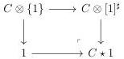
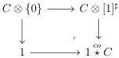
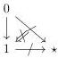
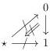
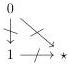
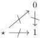
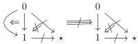
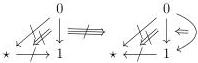
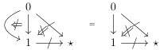
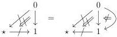

5.1. MARKED \((\infty, \omega)\)-CATEGORIES

respectively called the marked Gray cone and the marked Gray o-cone, where for any marked  \( (\infty,\omega) \) -category C,  \( C\star1 \)  and  \( 1^{\star c}C \) , fit in the following cocartesian square

These two functors preserve colimit. The proposition 5.1.3.3 induces an invertible natural transformation

\[
C \star 1 \sim (1 ^ {\star} C ^ {\circ}) ^ {\circ}.
\]

Example 5.1.3.6. In all the following diagrams, marked cells are represented by crossed-out arrows.

The objects \(\mathbf{D}_1^\flat \star 1\) and \(1\stackrel {co}{\star}\mathbf{D}_1^\flat\) correspond respectively the diagrams

the objects \((\mathbf{D}_1)_t\star 1\) and \(1\stackrel {co}{\star}(\mathbf{D}_1)_t\) correspond respectively the diagrams

the objects \(\mathbf{D}_2^\flat \star 1\) and \(1\stackrel {co}{\star}\mathbf{D}_2^\flat\) correspond respectively the diagrams

and the objects \((\mathbf{D}_2)_t\star 1\) and \(1\stackrel {co}{\star}(\mathbf{D}_2)_t\) correspond respectively the diagrams

We will also denote by

\[
\begin{array}{c c c} (\infty , \omega) \text {-cat} _ {\mathrm{m} _ {\bullet}} & \to & (\infty , \omega) \text {-cat} _ {\mathrm{m}} \\ (C, c) & \mapsto & C _ {/ c} \end{array}
\]

\[
\begin{array}{c c c} (\infty , \omega) \text {-cat} _ {\mathrm{m} _ {\bullet}} & \to & (\infty , \omega) \text {-cat} _ {\mathrm{m}} \\ (C, c) & \mapsto & C _ {c /} \end{array}
\]

249