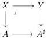

Introduction

ways to mark an $(\infty, \omega)$-category $C$. In the first, denoted by $C^0$, we mark as little as possible. In the second, denoted by $C^\sharp$, we mark everything.

The first section of the chapter defines these objects and establishes analogs of many results from section 4.2 to this new framework. In particular, the marked Gray cylinder $\_ \otimes [1]^\sharp$ is defined. If $A$ is an $(\infty, \omega)$-category, the underlying $(\infty, \omega)$-category of $A^\sharp \otimes [1]^\sharp$ is $A \times [1]$, and the underlying $(\infty, \omega)$-category of $A^0 \otimes [1]^\sharp$ is $A \otimes [1]$. By varying the marking, and at the level of underlying $(\infty, \omega)$-categories, we "continuously" move from the cartesian product with the directed interval to the Gray tensor product with the directed interval.

The motivation for introducing markings comes from the notion of left (and right) cartesian fibrations. A left cartesian fibration is a morphism between marked $(\infty, \omega)$-categories such that only the marked cells of the codomain have cartesian lifting, and the marked cells of the domain correspond exactly to such cartesian lifting. For example, a left cartesian fibration $X \to A^\sharp$ is just a "usual" left cartesian fibration where we have marked the cartesian lifts of the domain, and every morphism $C^0 \to D^0$ is a left cartesian fibration. This shows that marking plays a very different role here than in the case of marked simplicial sets, where it was there to represent (weak) invertibility. For example, if we had wanted to carry out this work in a complicial-like model category, we would have had to consider bimarked simplicial sets.

After defining and enumerating the stability properties enjoyed by this class of left (and right) cartesian fibration, we give several characterizations of this notion in theorem 5.2.1.26.

The more general subclass of left cartesian fibrations that still behaves well is the class of classified left cartesian fibrations. This corresponds to left cartesian fibrations $X \to A$ such that there exists a cartesian square:

where the right vertical morphism is a left cartesian fibration and $A^\sharp$ is obtained from $A$ by marking all cells. In the second section, we prove the following fundamental result:

**Theorem 5.2.2.12.** Let $p : X \to A$ be a classified left cartesian fibration. Then the functor $p^* : (\infty, \omega)\text{-cat}_{\mathrm{m}/A} \to (\infty, \omega)\text{-cat}_{\mathrm{m}/X}$ preserves colimits.

The third subsection is devoted to the proof of the following theorem

**Theorem 5.2.3.3.** Let $A$ be an $(\infty, \omega)$-category and $F : I \to (\infty, \omega)\text{-cat}_{\mathrm{m}/A^\sharp}$ be a diagram that is pointwise a left cartesian fibration. The induced morphism $\operatorname{colim}_I F$ is a left cartesian fibration over $A^\sharp$.

16