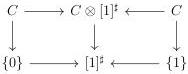

5.1. MARKED \((\infty, \omega)\)-CATEGORIES

By construction, we then have  \( C \ominus [1]^{\sharp} := C \otimes [1]^{\sharp} \) . The equation (4.3.1.15) implies that for every marked  \( (\infty, \omega) \) -category C, there is a natural identification between  \( [C, 1] \ominus [b, 1]^{\sharp} \)  and the colimit of the following diagram

\[
[ b, 1 ] ^ {\sharp} \vee [ C, 1 ] \leftarrow [ C \otimes \{0 \} \times b ^ {\sharp}, 1 ] \rightarrow [ (C \otimes [ 1 ] ^ {\sharp}) \times b ^ {\sharp}), 1 ] \leftarrow [ C \otimes \{1 \} \times b ^ {\sharp}, 1 ] \rightarrow [ C, 1 ] \vee [ b, 1 ] ^ {\sharp} \tag {5.1.3.14}
\]

Proposition 5.1.3.15. There is an equivalence

\[
(C \ominus B ^ {\sharp}) ^ {\circ} \sim C ^ {\circ} \ominus (B ^ {\circ}) ^ {\sharp}
\]

natural in C and B.

Proof. It is sufficient to construct this equivalence when \( B \) is of shape \( [b, n] \). The corollary 4.3.3.22 induces an equivalence

\[
(C ^ {\sharp} \otimes [ n ]) ^ {\circ} \sim (C ^ {\circ}) ^ {\sharp} \otimes [ n ] ^ {\circ}.
\]

By the construction of the Gray tensor product of marked \((\infty, \omega)\)-categories, we have an equivalence

\[
(C \otimes [ n ] ^ {\sharp}) ^ {\circ} \sim C ^ {\circ} \otimes ([ n ] ^ {\circ}) ^ {\sharp}.
\]

The results then directly follows from the definition of the operation \(\ominus\) and from the equivalence \((m_{b^{\sharp}}(\_))^{\circ} \sim m_{(b^{\sharp})^{\circ}}((\_)^{\circ})\).

Proposition 5.1.3.16. Let \( C \) be a \( (\infty, \omega) \)-category, \( D \) a marked \( (\infty, \omega) \)-category and \( [b, n] \) a globular sum.

(1) The underlying \((\infty, \omega)\)-category of \(C^{\circ} \ominus [b, n]^{\sharp}\) is \(C \ominus [b, n]\).
(2) The canonical morphism \( C^{\sharp} \ominus [b, n]^{\sharp} \to C^{\sharp} \times [b, n]^{\sharp} \) is an equivalence.
(3) The canonical morphism \((C^{\sharp} \times D) \ominus [b, n]^{\sharp} \to C^{\sharp} \times (D \ominus K^{\sharp})\) is an equivalence.

Proof. This is a consequence of propositions 4.2.1.51, 5.1.2.2, 5.1.2.3 and 5.1.2.5 and of the construction of \(\ominus\).

##### 5.1.3.17. We now give some strictification results.

Lemma 5.1.3.18. Let \(C\) be a marked \((\infty, \omega)\)-category. The canonical squares

are cartesian.

251