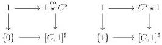

5.1. MARKED \((\infty, \omega)\)-CATEGORIES

diagram admits a special colimit. As all the morphisms are monomorphism, this implies that  \( (\mathbf{D}_{n+1})_{t} \otimes [1]^{\sharp} \)  is strict, which concludes the proof. □

Proposition 5.1.3.21. If \( C \) is a marked \( (\infty, \omega) \)-category, a a globular sum and \( a^{\flat} \to C \) any morphism, the \( (\infty, \omega) \)-categories \( C \coprod_{a^{\flat}} a^{\flat} \otimes [1]^{\sharp} \), \( C \coprod_{a^{\flat}} \star 1 \) and \( 1 \stackrel{co}{\star} a^{\flat} \coprod_{a} C \) are strict.

Proof. Using the first assertion of proposition 5.1.2.2, the underlying \((\infty, \omega)\)-categories of \(C \coprod_{a^{\flat}} a^{\flat} \otimes [1]^{\sharp}\), \(C \coprod_{a^{\flat}} a^{\flat} \star 1\) and \(1 \stackrel{co}{\star} a^{\flat} \coprod_{a} C\) are respectively \(C^{\natural} \coprod_{a} a \otimes [1]\), \(C^{\natural} \coprod_{a} a \star 1\) and \(1 \stackrel{co}{\star} a \coprod_{a} C^{\natural}\), which are strict objects according to propositions 4.3.3.12 and 4.3.3.17.

Theorem 5.1.3.22. If \( C \) is strict \( (\infty, \omega) \)-category, the marked \( (\infty, \omega) \)-categories \( C^{\flat} \star 1 \), \( 1 \stackrel{co}{\star} C^{\flat} \) and \( C^{\flat} \otimes [1]^{\sharp} \) are strict.

Proof. The first assertion of proposition 5.1.2.2 implies that the underlying \((\infty, \omega)\)-categories of these marked \((\infty, \omega)\)-categories respectively are \(C \star 1\), \(1 \stackrel{co}{\star} C\) and \(C \otimes [1]\). As these objects are strict according to theorem 4.3.3.26, this concludes the proof.

Proposition 5.1.3.23. The colimit preserving endofunctor \(F: (\infty, \omega)\)-cat \(\rightarrow (\infty, \omega)\)-cat\(_{\mathfrak{m}}\), sending \([a, n]\) to the colimit of the span

\[
\coprod_ {k \leq n} \{k \} \leftarrow \coprod_ {k \leq n} a ^ {\flat} \otimes \{k \} \rightarrow a ^ {\flat} \otimes [ n ] ^ {\sharp}
\]

is equivalent to the functor \((\_)^{\sharp}:(\infty ,\omega)\) -cat \(\rightarrow (\infty ,\omega)\) -catm.

Proof. This is a direct consequence of the first assertion of proposition 5.1.2.2, of corollary 4.3.3.24 and of the definition of the marking of the Gray tensor product for marked \((\infty, \omega)\)-categories.

The last proposition implies that for any marked  \( (\infty,\omega) \) -category C and any globular sum a, the simplicial  \( \infty \) -groupoid

\[
\begin{array}{l} \Delta^ {o p} \rightarrow \infty \text {-grd} \\ [ n ] \mapsto \operatorname{Hom} ([ a, n ] ^ {\sharp}, C) \\ \end{array}
\]

is a \((\infty, 1)\)-category.

Theorem 5.1.3.24. Let \( C \) be an \( (\infty, \omega) \)-category. The two following canonical squares are cartesian:

253