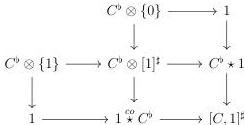

CHAPTER 5. THE $(\infty, 1)$-CATEGORY OF MARKED $(\infty, \omega)$-CATEGORIES

The five squares appearing in the following canonical diagram are both cartesian and cocartesian:

Proof. This is a direct consequence of the first assertion of proposition 5.1.2.2, of theorem 4.3.3.25 and of the definition of the marking of the Gray tensor product for marked $(\infty, \omega)$-categories. □

### 5.1.4 Marked Gray deformation retract

We provide analogous results for section 4.3.2, with proofs that are entirely similar and, therefore, omitted.

5.1.4.1. A left Gray deformation retract structure for a morphism $i : C \to D$ between marked $(\infty, \omega)$-categories is the data of a retract $r : D \to C$, a deformation $\psi : D \otimes [1]^\sharp \to D$, and equivalences

$$ri \sim id_C \quad \psi_{|D \otimes \{0\}} \sim ir \quad \psi_{|D \otimes \{1\}} \sim id_D \quad \psi_{|C \otimes [1]^\sharp} \sim i \operatorname{cst}_C$$

A morphism $i : C \to D$ between marked $(\infty, \omega)$-categories is a left Gray deformation retract if it admits a left deformation retract structure. By abuse of language, such data will just be denoted by $(i, r, \psi)$.

We define dually the notion of right Gray deformation retract structure and of right Gray deformation retract in exchanging 0 and 1 in the previous definition.

We define similarly the notion of left or right deformation retract by replacing $\otimes$ by $\times$.

5.1.4.2. A left Gray deformation retract structure for a morphism $i : f \to g$ in the $(\infty, 1)$-category of arrows of $(\infty, \omega)$-cat$_m$ is the data of a retract $r : g \to f$, a deformation $\psi : g \otimes [1]^\sharp \to g$ and equivalences

$$ri \sim id_f \quad \psi_{|g \otimes \{0\}} \sim ir \quad \psi_{|g \otimes \{1\}} \sim id_D \quad \psi_{|f \otimes [1]^\sharp} \sim i \operatorname{cst}_C$$

A morphism $i : C \to D$ between two arrows of $(\infty, \omega)$-cat$_m$ is a left Gray deformation retract if it admits a left deformation retract structure. By abuse of language, such data will just be denoted by $(i, r, \psi)$.

254