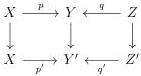

5.1. MARKED \((\infty, \omega)\)-CATEGORIES

We define dually the notion of right Gray deformation retract structure and of right Gray deformation retract in exchanging 0 and 1 in the previous definition.

We define similarly the notion of left and right deformation retract by replacing \(\otimes\) by \(\times\).

Example 5.1.4.3. Let C be a marked  \( (\infty,\omega) \) -category. The morphism  \( C\otimes\{0\}\to C\otimes[1]^{\sharp} \)  is a left Gray deformation retract. Indeed, the retract is given by  \( C\otimes\mathbb{I}:C\otimes[1]^{\sharp}\to C\otimes\{0\} \) , and the natural transformation is induced by

\[
(C \otimes [ 1 ] ^ {\sharp}) \otimes [ 1 ] ^ {\sharp} \sim C \otimes ([ 1 ] \times [ 1 ]) ^ {\sharp} \xrightarrow {C \otimes \psi^ {\sharp}} C \otimes [ 1 ] ^ {\sharp}
\]

where the first equivalence is the one of proposition 5.1.2.5, and \(\psi : [1] \times [1] \to [1]\) is the unique morphism sending \((\epsilon, \epsilon')\) to \(\epsilon \wedge \epsilon'\).

Similarly, the morphism \(C \otimes \{1\} \to C \otimes [1]^{\sharp}\) is a right deformation retract.

##### 5.1.4.4. Left and right Gray retracts enjoy many stability properties:

Proposition 5.1.4.5. Let \((i_a, r_a, \psi_a)\) be a natural family of left (resp. right) Gray deformation retract structures indexed by an \((\infty, 1)\)-category \(A\). The triple \((\operatorname{colim}_A i_a, \operatorname{colim}_A r_a, \operatorname{colim}_A \psi_a)\) is a left (resp. right) \(k\)-Gray deformation retract structure.

Proposition 5.1.4.6. Suppose given a diagram

such that \( p \to p' \) and \( q \to q' \) are left (resp. right) Gray deformation retract. The induced square \( q^*p \to (q')^*p' \) is a left (resp. right) \( k \)-Gray deformation retract.

Proposition 5.1.4.7. If \( p \to p' \) and \( p' \to p'' \) are two left (resp. right) Gray deformation retracts, so is \( p \to p'' \).

Proposition 5.1.4.8. Let \((i:C\to D,r,\psi)\) be a left (resp. right) Gray deformation structure. For any \(x:C\) and \(y:D\) (resp. \(x:D\) and \(y:C\)), the morphism

\[
\hom_ {C} (x, r y) \stackrel {i} {\rightarrow} \hom_ {D} (i x, i r y) \stackrel {\psi_ {y!}} {\longrightarrow} \hom_ {D} (i x, y)
\]

\[
(r e s p. \hom_ {C} (r x, y) \stackrel {i} {\rightarrow} \hom_ {D} (i r x, i y) \stackrel {\psi_ {y!}} {\longrightarrow} \hom_ {D} (x, i y))
\]

is a right (resp. left) Gray deformation retract, whose retract is given by

\[
\hom_ {D} (i x, y) \xrightarrow {r} \hom_ {C} (x, r y)
\]

\[
(r e s p. \hom_ {D} (x, i y) \stackrel {r} {\rightarrow} \hom_ {C} (r x, y))
\]

255