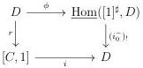
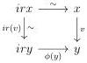

5.1. MARKED \((\infty, \omega)\)-CATEGORIES

Proposition 5.1.4.12. Let \( i: C \to D \) be a left Gray deformation retract and \( A \) a marked \( (\infty, \omega) \)-category. The morphism \( A \times i \) is a left Gray deformation retract.

Proof. Let \( r \) and \( \psi \) be retracts and deformation of \( i \). We define \( \psi_A \) as the composite

\[
(A \times D) \otimes [ 1 ] ^ {\sharp} \to A \times (D \otimes [ 1 ] ^ {\sharp}) \xrightarrow {A \times \psi} A \times D
\]

Remark that the triple \((A\times i,A\times r,\psi_A)\) is a left Gray deformation retract structure.

Proposition 5.1.4.13. Let \((i:[C,1]\to D,r,\phi)\) be a left deformation retract structure. The following natural square is cartesian:

Proof. We set  \( P := [C, 1] \times_{D} \underline{\mathrm{Hom}}([1]^{\sharp}, D) \)  and  \( \psi : D \to P \)  the induced morphism. The proposition 5.1.1.34 implies that  \( \hom_{P}(\psi(x), \psi(y)) \)  is the limit of the diagram:

\[
\hom_ {[ C, 1 ]} (r x, r y) \xrightarrow {i} \hom_ {D} (i r x, i r y) \xrightarrow {\phi_ {y !}} \hom_ {D} (i r x, y) \xleftarrow {\phi_ {x !}} \hom_ {D} (x, y)
\]

The proposition 5.1.4.8 then implies that the canonical morphism

\[
\hom_ {D} (x, y) \to \hom_ {P} (\psi (x), \psi (y))
\]

is an equivalence.

The morphism  \( \psi \)  is then fully faithful. According to proposition 5.1.1.24, it remains to show that it induces a surjection on objects. For this, let  \( v : x \to y \)  be an element of P. As the only marked 1-cells in  \( [C, 1] \)  are equivalences,  \( r(v) \)  is an equivalence. The morphism

\[
[ 1 ] ^ {\sharp} \times [ 1 ] ^ {\sharp} \xrightarrow {v \times [ 1 ] ^ {\sharp}} D \times [ 1 ] ^ {\sharp} \xrightarrow {\phi} D
\]

induces a square in D of shape

where all the arrows labeled by  \( \sim \)  are equivalences. This implies that  \( v \sim \phi(y) \)  and the morphism  \( \psi \)  is then surjective on objects. This concludes the proof. ☐

257