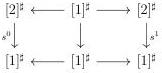
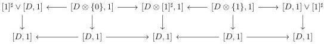

5.2. CARTESIAN FIBRATIONS

These morphisms will be called the *marked trivializations*.

**Proposition 5.2.1.6.** *Let $C$ be a marked $(\infty, \omega)$-category. The morphism $C \otimes [1]^{\sharp} \to C$ is in the smallest cocomplete $\infty$-groupoid of morphism containing the marked trivialization. In particular, this morphism is both initial and final.*

*Proof.* We denote $K$ the smallest cocomplete $\infty$-groupoid of morphisms containing the marked trivializations. As the $\infty$-groupoid of objects $C$ fulfilling the wanted property is closed by colimits, it is sufficient to demonstrate the result for $C$ being either $\mathbf{D}_n^b$ or $(\mathbf{D}_{n+1})_t$ for $n$ an integer. We will then proceed by induction. Suppose first that $C$ is $\mathbf{D}_0^b$ or $(\mathbf{D}_1)_t$. The first case is trivial, for the second one, remark that $(\mathbf{D}_1)_t \otimes [1]^{\sharp} \sim [1]^{\sharp} \times [1]^{\sharp} \to [1]^{\sharp}$ is the horizontal colimit of the diagram

and is then in $K$. Suppose now the result is true at the stage $(n - 1)$. Let $C$ be $\mathbf{D}_n^b$ (resp. $(\mathbf{D}_{n+1})_t$). We set $D := \mathbf{D}_{n-1}^b$ (resp. $D := (\mathbf{D}_n)_t$). We then have $C \sim [D, 1]$. The equation (5.1.3.9) implies that $C \otimes [1]^{\sharp} \to C$ is the horizontal colimit of the diagram:

The leftest and rightest morphisms obviously are in $K$. As marked trivializations are stable by suspension, the induction hypothesis implies that the middle vertical morphisms of the previous diagram are in $K$, which concludes the proof. $\square$

**Proposition 5.2.1.7.** *Let $C$ be a marked $(\infty, \omega)$-category. The morphism $C \otimes [1]^{\sharp} \to C \times [1]^{\sharp}$ is in the smallest cocomplete $\infty$-groupoid of morphism containing the marked trivializations. In particular, this morphism is both initial and final.*

*Proof.* We denote $K$ the smallest cocomplete $\infty$-groupoid of morphisms containing the marked trivializations. As the $\infty$-groupoid of objects $C$ fulfilling the wanted property is closed by colimits, it is sufficient to demonstrate the result for $C$ being either $\mathbf{D}_n^b$ or $(\mathbf{D}_{n+1})_t$ for $n$ an integer. If $C$ is either $(\mathbf{D}_0)^b$ or $(\mathbf{D}_1)_t$ the considered morphism is the identity. We then suppose that $n > 0$. Let $C$ be $\mathbf{D}_n^b$ (resp. $(\mathbf{D}_{n+1})_t$). We set $D := \mathbf{D}_{n-1}^b$ (resp. $D := (\mathbf{D}_n)_t$). We then have $C \sim [D, 1]$. The equation (5.1.3.9) and the equation

259