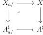

In the fourth subsection we study *smooth* and *proper* morphisms and we obtain the following expected result:

**Proposition 5.2.4.16.** *For a morphism $X \rightarrow A^\sharp$, and an object $a$ of $A$, we denote by $X_{/a}$ the marked $(\infty, \omega)$-category fitting in the following cartesian squares.*

*We denote by $\perp : (\infty, \omega)\text{-cat}_m \rightarrow (\infty, \omega)\text{-cat}$ the functor sending a marked $(\infty, \omega)$-category to its localization by marked cells.*

(1) *Let $E$, $F$ be two elements of $(\infty, \omega)\text{-cat}_{m/A^\sharp}$ corresponding to morphisms $X \rightarrow A^\sharp$, $Y \rightarrow A^\sharp$, and $\phi : E \rightarrow F$ a morphism between them. We denote by $\mathbf{F}E$ and $\mathbf{F}F$ the left cartesian fiborant replacement of $E$ and $F$.*

*The induced morphism $\mathbf{F}\phi : \mathbf{F}E \rightarrow \mathbf{F}F$ is an equivalence if and only if for any object $a$ of $A$, the induced morphism*

$$\perp X_{/a} \rightarrow \perp Y_{/a}$$

*is an equivalence of $(\infty, \omega)$-categories.*

(2) *A morphism $X \rightarrow A^\sharp$ is initial if and only if for any object $a$ of $A$, $\perp X_{/a}$ is the terminal $(\infty, \omega)$-category.*

Finally, in the last subsection, for a marked $(\infty, \omega)$-category $I$, we define and study a (huge) $(\infty, \omega)$-category $\underline{\mathrm{LCart}}^c(I)$ that has classified left cartesian fibrations as objects and morphisms between classified left cartesian fibrations as arrows.

**Chapter 6.** This chapter aims to establish analogs of the fundamental categorical constructions to the $(\infty, \omega)$ case. In the first section, we define the $(\infty, \omega)$-category of small $(\infty, \omega)$-categories $\underline{\omega}$ (paragraph 6.1.1.15), and we prove a first incarnation of the Grothendieck construction:

**Corollary 6.1.2.21.** *Let $\underline{\omega}$ be the $(\infty, \omega)$-category of small $(\infty, \omega)$-categories, and $A$ an $(\infty, \omega)$-category. There is an equivalence*

$$\int_A : \mathrm{Hom}(A, \underline{\omega}) \rightarrow \tau_0 \mathrm{LCart}(A^\sharp).$$

*where $\tau_0 \mathrm{LCart}(A^\sharp)$ is the $\infty$-groupoid of left cartesian fibrations over $A^\sharp$ with small fibers.*

17