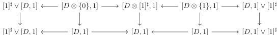

CHAPTER 5. THE $(\infty, 1)$-CATEGORY OF MARKED $(\infty, \omega)$-CATEGORIES

given in 5.1.1.34 imply that $C \otimes [1]^\sharp \to C \times [1]^\sharp$ is the horizontal colimit of the diagram:

The proposition 5.2.1.6 then states that the middle vertical morphisms of the previous diagram are in $K$, which concludes the proof. $\square$

**Proposition 5.2.1.8.** *If $i$ is an initial morphism, $[i, 1]$ is a final morphism. Conversely, if $i$ is a final morphism, $[i, 1]$ is an initial morphism.*

*Proof.* As the suspension preserves colimits, we can restrict to the case where $i$ is of shape $C \otimes \{0\} \to C \otimes [1]^\sharp$, and this is then a consequence of propositions 5.1.4.10 and 5.2.1.3. $\square$

**Proposition 5.2.1.9.** *For any marked $(\infty, \omega)$-category $K$, the functor $K \times \_ : (\infty, \omega)\text{-cat}_\text{m} \to (\infty, \omega)\text{-cat}_\text{m}$ preserves initial and final morphisms.*

*Proof.* The functor $K \times \_$ preserves colimits and this is then enough to show that it preserves left and right Gray deformation retracts, which is a consequence of proposition 5.1.4.12. $\square$

**5.2.1.10.** *A left cartesian fibration is a morphism $f : C \to D$ between marked $(\infty, \omega)$-categories having the unique right lifting property against initial morphisms. A right cartesian fibration is a morphism $f : C \to D$ between marked $(\infty, \omega)$-categories having the unique right lifting property against final morphisms.*

Left and right cartesian fibrations are stable under limits, retract, composition and right cancellation according to the result of section 4.1.2.

The proposition 5.1.3.3 implies that the full duality $(\_)^\circ$ sends left (resp. right) cartesian fibrations to right (resp. left) cartesian fibrations.

The construction 4.1.2.14 produces a unique factorization system between initial (resp final) morphisms and left (resp. right) cartesian fibrations. If $f : A \to B$ is any morphism, we will denote by $\mathbf{F}f : A' \to B$ the left cartesian fibration obtained via this factorization system.

**Proposition 5.2.1.11.** *If $f : C \to D^\flat$ is a left cartesian fibration, then the canonical morphism $(C^\flat)^\flat \to C$ is an equivalence. Conversely, any morphism $C^\flat \to D^\flat$ is a left cartesian fibration.*

*Proof.* The first assertion is a consequence of the fact that marked trivializations are initial. The second assertion is a direct consequence of proposition 5.2.1.6. $\square$

260