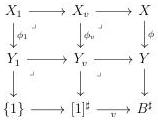
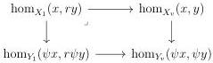
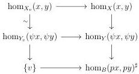

CHAPTER 5. THE \((\infty,1)\)-CATEGORY OF MARKED \((\infty,\omega)\)-CATEGORIES

Proof. As  \( \mathrm{tPsh}^{\infty}(\Theta) \)  is locally cartesian closed, pullback commutes with special colimits, and as every  \( (\infty,\omega) \) -category is the special colimit of its k-truncation for  \( k\in N \)  according to proposition 5.1.1.35, one can suppose that B is a marked  \( (\infty,k) \) -category for  \( k<\omega \), and we then proceed by induction on k. Suppose then the result is true for  \( (\infty,k) \) -categories and that B is an  \( (\infty,k+1) \) -category. Remark first that  \( \phi \)  induces an equivalence between  \( \tau_{0}(X) \)  and  \( \tau_{0}(Y) \).

Let \( x \) and \( y \) be two objects of \( X \) and \( v: [1]^{\sharp} \to B^{\sharp} \) be a cell whose source is \( px \) and target \( py \). This induces cartesian squares

By hypothesis, \(\phi_1\) is an equivalence. According to proposition 5.2.1.13, \(\phi_1 \to \phi_v\) is a right deformation retract, and according to proposition 5.1.4.8, this induces a cartesian square

where horizontal morphisms are equivalences. By hypothesis, the left vertical one is an equivalence, and then, by two out of three, so is the right vertical one.

We then have, for any 1-cell v, the following cartesian squares

where the arrow labeled by  \( \sim \)  is an equivalence. As  \( \hom_{B}(px,py)^{\sharp} \)  is an  \( (\infty,k) \) -category, the induction hypothesis implies that  \( \hom_{X}(x,y)\to\hom_{Y}(\psi x,\psi y) \)  is an equivalence. The morphism  \( \phi \)  is then fully faithful, and as we already know that it is essentially surjective, this concludes the proof.

5.2.1.15. We have by construction a factorization system in initial morphism followed by left cartesian fibration, and another one in final morphism followed by right cartesian

262