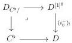
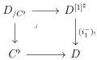
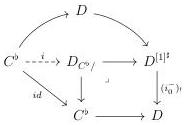

5.2. CARTESIAN FIBRATIONS

fibration. We are willing to find an explicit expression for such factorization in some easy cases. We then fix  \( i : C^{b} \to D \)  with D being any marked  \( (\infty, \omega) \) -category.

If \( C^b \to D \) is a functor between marked \( (\infty, \omega) \)-categories, we define \( D_{/C^b} \) and \( D_{C^b/} \) as the following pullbacks

If \( C \) is the terminal \( (\infty, \omega) \)-category, this notation is compatible with the one of the slice over and under introduced in paragraph 5.1.3.5.

Lemma 5.2.1.16. The morphism \(i:C^{b}\to D_{/C^{b}}\) appearing in the following diagram

is initial.

Proof. Using proposition 5.1.2.5, we have a natural transformation

\[
(\_ \otimes [ 1 ] ^ {\sharp}) \otimes [ 1 ] ^ {\sharp} \sim \_ \otimes ([ 1 ] ^ {\sharp} \times [ 1 ] ^ {\sharp}) \xrightarrow {\otimes \psi} \_ \otimes [ 1 ] ^ {\sharp}
\]

where \(\psi\) sends \((\epsilon, \epsilon')\) on \(\max(\epsilon, \epsilon')\). This induces a natural transformation \(D^{[1]^{\sharp}} \to (D^{[1]^{\sharp}})^{[1]^{\sharp}}\), corresponding by adjunction to transformation \(\phi: D^{[1]^{\sharp}} \otimes [1]^{\sharp} \to D^{[1]^{\sharp}}\). We set \(r: D_{C^{\flat}/} \to C^{\flat}\) as the canonical projection. Eventually, remark that \((i, r, \phi)\) is a left Gray deformation retract. According to proposition 5.2.1.3, this concludes the proof.

Lemma 5.2.1.17. The composite \(q: D_{C^{\flat}/} \to D^{[1]^{\sharp}} \xrightarrow{(i_0^{+})_{!}} D\) is a left cartesian fibration.

Proof. Consider a commutative diagram

\[
\begin{array}{c} K \otimes \{0 \} \longrightarrow D _ {C ^ {\flat} /} \\ \Big \downarrow \quad \Big \downarrow \\ K \otimes [ 1 ] ^ {\sharp} \longrightarrow D \end{array} \tag {5.2.1.18}
\]

263