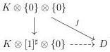
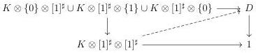
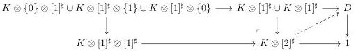

CHAPTER 5. THE \((\infty,1)\)-CATEGORY OF MARKED \((\infty,\omega)\)-CATEGORIES

The \(\infty\)-groupoid of lifts of this previous diagram is equivalent to the \(\infty\)-groupoid of pairs consisting of a commutative triangle

where \( f \) is induced by \( K \otimes \{0\} \to D_{C^{\flat}/} \), and a lift in the induced diagram

According to proposition 5.2.1.6, the morphism \( K \otimes [1]^{\sharp} \otimes \{0\} \to C^{\flat} \) factors through a morphism \( K \to C^{\flat} \), and is then uniquely determined by \( f: K \otimes \{0\} \otimes \{0\} \to C^{\flat} \), and proposition 5.1.2.5 provides a natural equivalence between \( (K \otimes [1]^{\sharp}) \otimes [1]^{\sharp} \) and \( K \otimes ([1]^{\sharp} \times [1]^{\sharp}) \). The \( \infty \)-groupoid of lifts of the diagram (5.2.1.18) is then equivalent to the \( \infty \)-groupoid of lifts of the left square of the following diagram

As \( K \otimes [1]^{\sharp} \coprod_{K \otimes [0]} K \otimes [1]^{\sharp} \to K \otimes [2]^{\sharp} \) is an equivalence, this \( \infty \)-groupoid is contractible.

Proposition 5.2.1.19. The factorisation of \( p: C^b \to D \) in an initial morphism followed by a left cartesian fibration is

\[
C ^ {b} \xrightarrow {i} D _ {C ^ {b} /} \xrightarrow {q} D,
\]

and its factorization in a final morphism and a right cartesian fibration is

\[
C ^ {b} \xrightarrow {i} D _ {/ C ^ {b}} \xrightarrow {q} D.
\]

Proof. This is a direct application of lemma 5.2.1.16 and 5.2.1.16 and of their dual version.

The more important example of the previous proposition is the case  \( C := \{a\} \) . In this case, the corresponding left cartesian fibration is the slice of D under a

\[
D _ {a /} \rightarrow D
\]

264