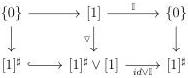
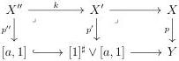

CHAPTER 5. THE \((\infty,1)\)-CATEGORY OF MARKED \((\infty,\omega)\)-CATEGORIES

Proof. The fact that 1-cells are left cancellable is equivalent to asking that i has the unique right lifting property against

\[
[ a, 1 ] \amalg_ {\{0 \}} [ 1 ] ^ {\sharp} \to [ 1 ] ^ {\sharp} \vee [ a, 1 ]
\]

for any object \( a \) of \( t\Theta \). Suppose that \( p \) fulfills (1). As the class of morphisms having the unique right lifting property against \( p \) are closed under composition and by left cancellation according to 4.1.2.3, this implies that \( p \) has the unique right lifting property against

\[
[ a, 1 ] \xrightarrow {\nabla} [ 1 ] ^ {\sharp} \vee [ a, 1 ]
\]

and then that (1) \(\Rightarrow\) (2).

Suppose now that \( p \) fulfills (2). Remark that we have a retract

and as the class of morphisms having the unique right lifting property against p is closed under retracts, this implies that p has the unique right lifting property against  \( \{0\}\to[1]^{\sharp} \) . By stability by left cancellation, p has the unique right lifting property against

\[
[ a, 1 ] \amalg_ {\{0 \}} [ 1 ] ^ {\sharp} \to [ 1 ] ^ {\sharp} \vee [ a, 1 ].
\]

As remarked above, this implies that 1-cells are left cancellable. We then have (1) \(\Leftrightarrow\) (2).

There is an obvious implication  \( (3) \Rightarrow (2) \) . For the converse, remark that the class of morphisms having the unique right lifting property against p is closed under colimits and then contains  \( \{0\} \rightarrow [1]^{\sharp} \vee [1]^{\sharp} \) , and so by left cancellation, it includes  \( [1]^{\sharp} \xrightarrow{\nabla} [1]^{\sharp} \vee [1]^{\sharp} \) . The proof of the equivalence of  \( (1)' \) ,  \( (2)' \)  and  \( (3)' \)  is symmetrical. ☐

Lemma 5.2.1.22. Let \( p: X \to Y \) be a morphism having the unique right lifting property against marked trivializations, such that for any element \( a \) of \( t\Theta \), and any cartesian squares:

the square \( p'' \to p' \) is a right deformation retract. Then, \( p \) has the unique right lifting property against \( [a,1] \xrightarrow{\nabla} [1]^{\sharp} \vee [a,1] \) for any object \( a \) of \( t\Theta \).

266