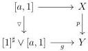
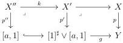
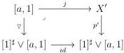
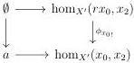

5.2. CARTESIAN FIBRATIONS

Proof. Suppose given a square

and let $p'$ and $p''$ be the morphisms appearing in the following cartesian squares:

To show the proposition, one has to demonstrate that the induced diagram

admits a unique lifting. We denote by $x_0$ and $x_2$ the image of the object of $[a, 1]$ via the morphism $j$, and $(k : X'' \to X', r, \phi)$ the left deformation retract existing by hypothesis. According to the dual version of proposition 5.1.4.13, the unique marked 1-cell in $X'$ over $[1]^{\sharp} \hookrightarrow [1]^{\sharp} \vee [a, 1]$ with $x_0$ for source is $\phi(x_0) : x_0 \to r(x_0)$. The $\infty$-groupoid of lifts of this diagram is then equivalent to the $\infty$-groupoid of lifts of the following diagram

However, the right vertical morphism is an isomorphism according to proposition 5.1.4.8 which concludes the proof.

5.2.1.23. Keeping in mind the last lemma, we define $\mathrm{I}_g$ and $\mathrm{F}_g$ as the smallest sets of morphisms of $(0, \omega)$-cat$_\mathrm{m}$ fulfilling these conditions:

(1) for any $a \in \Theta^{\ell}$, $[a, 1] \hookrightarrow [1]^{\sharp} \vee [a, 1]$ is in $\mathrm{F}_g$ and $[a, 1] \hookrightarrow [a, 1] \vee [1]^{\sharp}$ is in $\mathrm{I}_g$
(2) for any $i$ in $\mathrm{F}_g$, $[i, 1]$ is in $\mathrm{I}_g$, for any $j$ in $\mathrm{I}_g$, $[i, 1]$ is in $\mathrm{F}_g$,

Propositions 5.1.4.5 and 5.1.4.10 then imply that morphisms of $\mathrm{I}_g$ are left Gray deformation retracts and morphisms of $\mathrm{F}_g$ are right Gray deformation retracts.

267