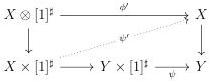

CHAPTER 5. THE \((\infty,1)\)-CATEGORY OF MARKED \((\infty,\omega)\)-CATEGORIES

5.2.1.24. We extend by induction the definition of right and left cancellable to cells of any dimension as follows: a n-cell v is left or right cancellable (resp. right cancellable) if the corresponding  \( (n-1) \) -cell of  \( \operatorname{hom}_{X}(x,y) \)  is left cancellable (resp. right cancellable) for the morphism  \( \operatorname{hom}_{X}(x,y)\to\operatorname{hom}_{Y}(px,py) \) , where x and y denote the 0-sources and 0-but of v.

Lemma 5.2.1.25. Let \( p': X' \to Y' \) be a morphism such that \( p \) has the unique right lifting property against marked trivializations and suppose that we have a left Gray deformation retract \( p' \to p \). We denote by \( (r: Y' \to Y, i, \phi) \) the left deformation retract structure induced on the codomain, and suppose that the deformation \( \phi: Y \otimes [1]^{\sharp} \to Y \) factors through \( \psi: Y \times [1]^{\sharp} \to Y \). Then, the square \( p' \to p \) is a left deformation retract.

Proof. Proposition 5.2.1.7 states that \( Y \otimes [1]^{\sharp} \to Y \times [1]^{\sharp} \) is a colimit of marked trivializations. There is then a lift in the following diagram:

where  \( \phi' \)  is the deformation induced on domains. This endows  \( p' \rightarrow p \)  with a structure of left deformation retract, where the retraction is the same, and the deformation is given by  \( (\psi', \psi) \) . ☐

Theorem 5.2.1.26. Consider the following shape of diagram

\[
\begin{array}{c} X ^ {\prime \prime} \longrightarrow X ^ {\prime} \longrightarrow X \\ p ^ {\prime \prime} \Biggl \downarrow \quad \quad \quad p ^ {\prime} \Biggl \downarrow \quad \quad \quad p \Biggl \downarrow \\ Y ^ {\prime \prime} \xrightarrow [ i ]{} Y ^ {\prime} \longrightarrow Y \end{array} \tag {5.2.1.27}
\]

The following are equivalent:

(1) The morphism \( p \) is a left cartesian fibration.
(2) \( p \) has the unique right lifting property against marked trivialization, and for any diagram of shape (5.2.1.27), if \( i \) is a right Gray deformation retract, so is \( p'' \to p' \).
(3) \( p \) has the unique right lifting property against marked trivialization and, for any diagram of shape (5.2.1.27), if \( i \) is in \( \mathrm{F}_g \), the square \( p'' \to p' \) is a right Gray deformation retract.
(4) For any even integer \( n \), \( p \) has the unique right lifting property against \( i_n^+ : \mathbf{D}_n \to (\mathbf{D}_{n+1})_t \) and marked \( n \)-cells are right cancellable; for any odd integer \( p \) has the unique right lifting property against \( i_n^- : \mathbf{D}_n \to (\mathbf{D}_{n+1})_t \) and marked \( n \)-cells are left cancellable.

268