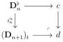
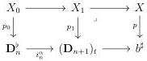
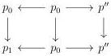
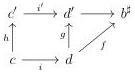
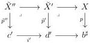

CHAPTER 5. THE \((\infty,1)\)-CATEGORY OF MARKED \((\infty,\omega)\)-CATEGORIES

We suppose that the second condition is fulfilled. As left Gray deformation retracts are stable under composition according to proposition 5.1.4.7, we can restrict to the case where $i': c \to d$ fits in a cocartesian square

where all morphisms are globular, and where $\alpha$ is $+$ if $n$ is even, and $-$ if not. Let $p_0$ and $p_1$ be the morphism fitting in cocartesian squares

This defines a diagram in the $(\infty, 1)$-category of arrows of $(\infty, \omega)$-cat$_m$:

As the proposition 5.2.2.4 implies that $p'$ is $d$-exponentiable, the morphism $p'' \to p'$ is the horizontal colimit of the previous diagram. According to proposition 5.2.1.13, $p_0 \to p_1$ is a left Gray deformation retract, and proposition 5.1.4.5 implies that $p'' \to p'$ also is a left Gray deformation retract. This proves (2) $\Rightarrow$ (3).

Suppose now that condition (3) is fulfilled and let $i$ be in F$_g$. Consider the diagram

induced by lemma 5.2.2.5. We denote by $\tilde{p}''$ and $\tilde{p}'$ the morphisms fitting in the following cartesian squares.

As $p$ fulfills (3), $\tilde{p}'' \to \tilde{p}'$ is a right Gray deformation retract. By construction, the square $h \to g$ also is a right Gray deformation retract. As $p''$ and $p'$ are respectively the pullback

274