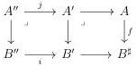
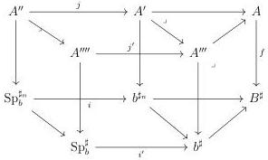
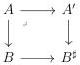

CHAPTER 5. THE \((\infty,1)\)-CATEGORY OF MARKED \((\infty,\omega)\)-CATEGORIES

Proof. As  \( \mathrm{tPsh}^{\infty}(\Theta) \)  is cartesian closed, one can suppose that i is in W. In this case the diagram can be seen as a diagram in  \( \mathrm{Psh}(\Theta) \) . The proof is an easy verification of all the possible cases. □

Proposition 5.2.2.11. For any cartesian square of \(\mathrm{tPsh}^{\infty}(\Theta)\),

where \( f \) is a left cartesian fibration, if \( i \) is in \( \widehat{\mathrm{tW}} \), so is \( j \).

Proof. As  \( \mathrm{tPsh}^{\infty}(\Theta) \)  is cartesian closed, one can suppose that i is in W. Several cases have to be considered. If i is of shape  \( (\Sigma^{n}E^{eq})^{b}\to\mathbf{D}_{n}^{b} \) , this is lemma 5.2.2.9. Suppose now that i is of shape  \( Sp_{b}^{\sharp_{n}}\to b^{\sharp_{n}} \) . This induces a diagram

where all squares are cartesian. Corollary 5.2.2.8 implies that \( j' \) is in \( \widehat{\mathrm{W}} \), and according to lemma 5.2.2.10, so is \( j \).

A left cartesian fibration  \( A \rightarrow B \)  is classified if there exists a cocartesian square:

Theorem 5.2.2.12. Let \( p: A \to B \) be a classified left cartesian fibration. The functor \( p^*: (\infty, \omega) \)-cat\(_{\mathrm{m}/B} \to (\infty, \omega) \)-cat\(_{\mathrm{m}/A}\) preserves colimits.

Proof. As  \( \mathrm{tPsh}(\Theta) \)  is locally cartesian closed, it is enough to show that the functor  \( p^{*}: \mathrm{tPsh}^{\infty}(\Theta)_{/B} \to \mathrm{tPsh}^{\infty}(\Delta[\Theta])_{/A} \)  sends tW onto  \( t\widehat{W} \) . As morphisms fulfilling this property are stable under pullback, one can suppose that p is of shape  \( B \to A^{\sharp} \) , then applies proposition 5.2.2.11. □

276