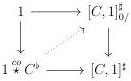
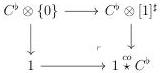
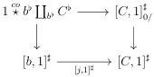

5.2. CARTESIAN FIBRATIONS

As it was the only non trivial case, we have $l\partial = \partial l$. We then have defined the desired lifting, which is obviously the unique one possible. Moreover, if we suppose that $f(e_n \otimes [1])$ is null and $g(e_n \otimes \{0\})$ corresponds to a marked cell, this implies that $s_{n+1}(f(e_n \otimes [1])) = 0$ and that the $g_n(e_n \otimes \{0\})$ is in the image of $s_n$. The object $f(e_n \otimes [1])$ also is in the image of $s_n$ and so corresponds to a marked cell.

**Lemma 5.2.3.7.** *There is a unique morphism $1 \stackrel{\mathrm{co}}{\star} C^{\flat} \to [C, 1]_{0/}^{\sharp}$ fitting in a square*

*This morphism is an equivalence whenever $C$ is a globular sum.*

*Proof.* We have by construction a cocartesian square

which implies that $1 \to 1 \stackrel{\mathrm{co}}{\star} C^{\flat}$ is initial. This directly implies the first assertion. We now prove the second assertion. We suppose that $C$ is a globular sum $a$. The $(\infty, \omega)$-categories $1 \stackrel{\mathrm{co}}{\star} a^{\flat}$ is strict according to proposition 5.1.3.20. Proposition 5.2.3.6 states that the canonical morphism $1 \stackrel{\mathrm{co}}{\star} a^{\flat} \to [a, 1]^{\sharp}$ is a left cartesian fibration. As the comparison map is initial by left cancellation, this concludes the proof.

**Proposition 5.2.3.8.** *Let $b$ be a globular form and $j : b \to C$ a morphism between $(\infty, \omega)$-categories. The following diagram is cartesian*

*Proof.* The lemma 5.2.3.7 implies that the morphism $1 \stackrel{\mathrm{co}}{\star} b^{\flat} \to [b, 1]^{\sharp}$ is equivalent to $\mathbf{F} h_0^{[b,1]}$. We then have to check that the canonical morphism

$$\mathbf{F} h_0^{[b,1]} \coprod_{b^{\flat}} C^{\flat} \to [j, 1]^* \mathbf{F} h_0^{[C,1]} \tag{5.2.3.9}$$

281