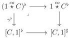
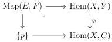
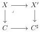

5.2. CARTESIAN FIBRATIONS

Proof. We have a cocartesian square

The theorem 5.2.3.10 implies that the right hand morphism is a left cartesian fibration, and $\gamma^b$ is then a classified left cartesian fibration. The result is then a direct consequence of theorem 5.2.2.12. The other assertion follows by duality. □

### 5.2.4 Smooth and proper morphisms

5.2.4.1. For a marked $(\infty, \omega)$-category $C$, we denote by $\mathrm{LCart}(C)$ (resp. $\mathrm{RCart}(C)$) the full sub $(\infty, 1)$-category of $(\infty, \omega)\text{-}\mathrm{cat}_{\mathrm{m}/C}$ whose objects are left cartesian fibrations. We can equivalently define $\mathrm{LCart}(C)$ as the localization of $(\infty, \omega)\text{-}\mathrm{cat}_{\mathrm{m}/C}$ along $\widehat{\mathrm{I}/C}$. For $E, F$ two objects of $\mathrm{LCart}(C)$ corresponding respectively to two left cartesian fibrations $p: X \to C$ and $q: X \to C$, we denote by $\mathrm{Map}(E, F)$ the $(\infty, \omega)$-category fitting in the cocartesian square:

5.2.4.2. We recall that a left cartesian fibration $X \to C$ is classified when there exists a cartesian square:

We denote by $\mathrm{LCart}^c(C)$ the full sub $(\infty, 1)$-category of $\mathrm{LCart}(C)$ whose objects are classified left cartesian fibrations.

5.2.4.3. Remark that every morphism $f: C \to D$ induces an adjunction

$$f_! : (\infty, \omega)\text{-}\mathrm{cat}_{/C} \xleftarrow{\quad} (\infty, \omega)\text{-}\mathrm{cat}_{/D} : f^*$$

where the left adjoint $f_!$ is the composition and the right one is the pullback. This induces an adjunction at the level of localized $(\infty, 1)$-category:

$$\mathbf{L}f_! : \mathrm{LCart}(C) \xleftarrow{\quad} \mathrm{LCart}(D) : \mathbf{R}f^* = f^*$$

283