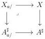

CHAPTER 5. THE \((\infty,1)\)-CATEGORY OF MARKED \((\infty,\omega)\)-CATEGORIES

As \(\pi_{a}\) is smooth, the canonical morphism \(X_{a / }\to \hat{X}_{a / }\) is initial. Combined with (5.2.4.12), this induces an equivalence:

\[
\mathbf {R} a ^ {*} (\mathbf {F} E) \sim \bot X _ {/ a} \tag {5.2.4.15}
\]

Proposition 5.2.4.16. For a morphism \( X \to A^{\sharp} \), and an object \( a \) of \( A \), we denote by \( X_{/a} \) the marked \( (\infty, \omega) \)-category fitting in the following cartesian square:

We denote by \(\bot : (\infty, \omega)\)-cat\(_{\mathrm{m}} \to (\infty, \omega)\)-cat the functor sending a marked \((\infty, \omega)\)-category to its localization by marked cells.

(1) Let \( E, F \) be two elements of \( (\infty, \omega) \)-cat\(_{\mathrm{m/A}^{\sharp}}\) corresponding to morphisms \( X \to A^{\sharp} \), \( Y \to A^{\sharp} \), and \( \phi : E \to F \) a morphism between them. The induced morphism \( \mathbf{F}\phi : \mathbf{F}E \to \mathbf{F}F \) is an equivalence if and only if for any object \( a \) of \( A \), the induced morphism

\[
\bot X _ {/ a} \to \bot Y _ {/ a}
\]

is an equivalence of \((\infty, \omega)\)-categories.

(2) A morphism \( X \to A^{\sharp} \) is initial if and only if for any object \( a \) of \( A \), \( \bot X_{/a} \) is the terminal \( (\infty, \omega) \)-category.

Proof. The first assertion is a direct consequence of the equation (5.2.4.15) and of the fact that equivalences between left cartesian fibrations are detected on fibers.

A morphism \( p: X \to A \) is initial if and only if \( \mathbf{F}p \) is equivalent to the identity of \( A^{\sharp} \), and according to the first assertion, if and only if for any object \( a \) of \( A \), the canonical morphism \( \bot X_{a/} \to \bot A_{a/}^{\sharp} \) is an equivalence. However, the canonical morphism \( \{a\} \to A_{/a}^{\sharp} \) is final, and \( \bot A_{a/}^{\sharp} \) is then the terminal \( (\infty, \omega) \)-category. This concludes the proof of the second assertion.

5.2.4.17. Suppose given a commutative square of marked  \( (\infty,\omega) \) -categories:

\[
\begin{array}{c} A \xrightarrow {j} C \\ v \Biggl \downarrow \quad \quad \quad \quad \quad \quad \quad \quad \quad \quad \quad \quad \quad \quad \quad \quad \quad \quad \quad \quad \quad \quad \quad \quad \quad \quad \quad \quad \quad \quad \quad \quad \quad \quad \quad \quad \quad \quad \quad \quad \quad \quad \quad \quad \quad \quad \quad \quad \quad \quad \text { (5.2.4.18) } \\ B ^ {\sharp} \xrightarrow [ i ]{} D ^ {\sharp} \end{array}
\]

286