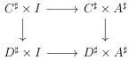
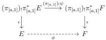
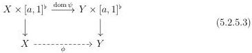
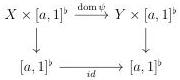

CHAPTER 5. THE \((\infty,1)\)-CATEGORY OF MARKED \((\infty,\omega)\)-CATEGORIES

Proposition 5.2.4.30. Let \( i: I \to A^{\sharp} \) be a smooth morphism and \( j: C^{\sharp} \to D^{\sharp} \) any morphism. The square

verifies the opposed Beck-Chevaley condition.

Proof. As  \( id_{C^{\sharp}} \times i \)  and  \( id_{D^{\sharp}} \times i \)  are pullbacks of i, they are smooth. The result is then follows from proposition 5.2.4.29. □

#### 5.2.5 The W-small  \( (\infty,\omega) \) -category of V-small left cartesian fibrations

5.2.5.1. Let \( I \) be a marked \( (\infty, \omega) \)-category, and \( a \) a globular sum. We recall that the pullback along the canonical projection \( \pi_a: I \times a^\flat \to I \) induces an adjunction

\[
\pi_ {a!} \colon (\infty , \omega) \text {-cat} _ {/ I \times a ^ {\flat}} \xrightarrow [ \leftarrow ]{\perp} (\infty , \omega) \text {-cat} _ {\mathrm{m} / I}: \pi_ {a} ^ {*}
\]

Lemma 5.2.5.2. Let \(E\) and \(F\) be two objects of \((\infty, \omega)\)-\(\mathrm{cat}_{\mathrm{m}/I}\) and \(\psi: \pi_{[a,1]}^{*}E \to \pi_{[a,1]}^{*}F\) an equivalence. The exists a unique commutative diagram of shape

Moreover, the arrow \(\phi\) is an equivalence.

Proof. Unfolding the definition, we have to show the existence and unicity of commutative diagrams of shape

where the two vertical morphisms are the projection and where X and Y correspond respectively to the domain of E and F. As  \( \operatorname{dom}\psi \)  is a morphism over  \( I \times [a,1]^{b} \) , we already have a commutative diagram of shape:

290