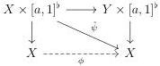

CHAPTER 5. THE \((\infty,1)\)-CATEGORY OF MARKED \((\infty,\omega)\)-CATEGORIES

which induces the wanted square:

Lemma 5.2.5.4. Let \( I \) be a marked \( (\infty, \omega) \)-category and a globular form. The canonical morphisms of \( \infty \)-groupoids:

\[
\pi_ {[ a, 1 ]} ^ {*}: \tau_ {0} (\infty , \omega) \text {-cat} _ {\mathrm{m} / I} \to \tau_ {0} (\infty , \omega) \text {-cat} _ {\mathrm{m} / I \times [ a, 1 ] ^ {\flat}}
\]

\[
\pi_ {[ a, 1 ]} ^ {*}: \tau_ {0} \operatorname{Arr} ((\infty , \omega) \text {-cat} _ {\mathrm{m} / I}) \to \tau_ {0} \operatorname{Arr} ((\infty , \omega) \text {-cat} _ {\mathrm{m} / I \times [ a, 1 ] ^ {\flat}})
\]

are fully faithful.

Proof. Let \( E \) and \( F \) be two objects of \( (\infty, \omega) \)-cat\(_{\mathrm{m}/I}\). The morphism

\[
\mathrm{Hom} _ {\tau_ {0} (\infty , \omega) \text {-cat} _ {\mathrm{m} / I}} (E, F) \to \mathrm{Hom} _ {\tau_ {0} (\infty , \omega) \text {-cat} _ {\mathrm{m} / I \times [ a, 1 ] ^ {\flat}}} (\pi_ {[ a, 1 ]} ^ {*} E, \pi_ {[ a, 1 ]} ^ {*} F)
\]

has an inverse that sends \(\psi : \pi_{[a,1]}^{*}E \to \pi_{[a,1]}^{*}F\) onto the morphism \(\phi : E \to F\) appearing in the commutative square provided by lemma 5.2.5.2.

The second assertion is demonstrated similarly.

Proposition 5.2.5.5. Let \( I \) be a marked \( (\infty, \omega) \)-category and a globular form. We denote by \( \pi_a : I \times a^\flat \to I \) the canonical projection. The canonical morphisms of \( \infty \)-groupoids:

\[
\mathbf {R} \pi_ {a} ^ {*}: \tau_ {0} \mathrm{LCart} ^ {c} (I) \to \tau_ {0} \mathrm{LCart} ^ {c} (I \times a ^ {\flat})
\]

\[
\mathbf {R} \pi_ {a} ^ {*}: \tau_ {0} \operatorname{Arr} (\mathrm{LCart} ^ {c} (I)) \to \tau_ {0} \operatorname{Arr} (\mathrm{LCart} ^ {c} (I \times a ^ {\flat}))
\]

are fully faithful.

Proof. Let  \( [b, n] := a \) . Considere first the adjunction:

\[
\begin{array}{c} \operatorname{LCart} ^ {c} (I \times [ b _ {0}, 1 ] ^ {\flat}) \times_ {\operatorname{LCart} ^ {c} (I)} \dots \times_ {\operatorname{LCart} ^ {c} (I)} \operatorname{LCart} ^ {c} (I \times [ b _ {n - 1}, 1 ] ^ {\flat}) \\ \Big \uparrow \vdash \Big \downarrow \operatorname{colim} _ {I} \\ \operatorname{LCart} ^ {c} (I ^ {\flat} \times [ \mathbf {b}, n ]) \end{array}
\]

The corollary 5.2.2.13 implies that the counit of this adjunction is an equivalence. This implies that the right adjoint

\[
\operatorname{LCart} ^ {c} (I ^ {\flat} \times [ \mathbf {b}, n ]) \to \operatorname{LCart} ^ {c} (I \times [ b _ {0}, 1 ] ^ {\flat}) \times_ {\operatorname{LCart} ^ {c} (I)} \dots \times_ {\operatorname{LCart} ^ {c} (I)} \operatorname{LCart} ^ {c} (I \times [ b _ {n - 1}, 1 ] ^ {\flat})
\]

292